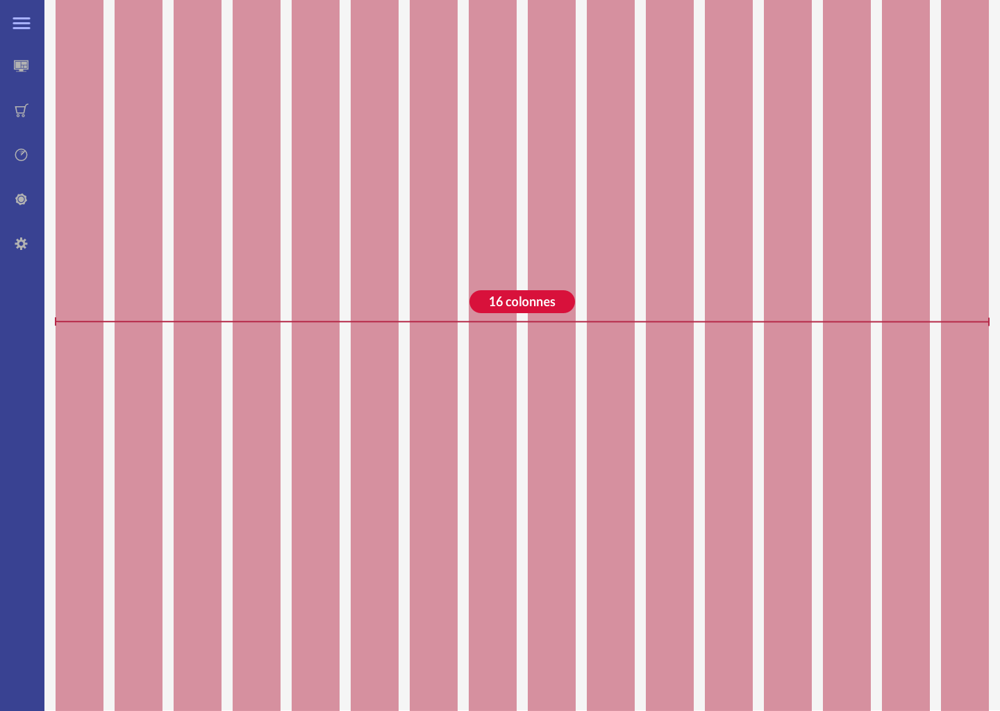

* table of contents
{:toc}

Le principe de [grille](https://getbootstrap.com/docs/4.5/layout/grid/) est utilisé sur toute l'interface. Lorsqu'il sera évoqué un élément basé sur une largeur de 4 ou de 6 colonnes, cela sera basé sur la grille évoquée ici.

Pour la zone de contenu, les spécifications sont données pour une largeur de 16 colonnes. Les gouttières feront `16px`.

``` scss
$grid-columns:      16 !default;
$grid-gutter-width: 16px !default;
```

La grille n'englobe pas la navigation principale, sur la gauche. Cela signifie que la largeur des colonnes est redéfinie lorsque cette navigation est repliée.


<hr/>



Les tableaux échappent à ce principe, la largeur des colonnes étant avant tout définie par la quantité de contenu des cellules. On pourra forcer la largeur de certaines colonnes, mais cela échappe au principe de grille décrit ici.

#### Exemple ####

Dans la documentation, lorsqu'il sera défini qu'un élement `#item` est basé sur une largeur de 8 colonnes, on le définira de la sorte :

``` html
<div id="item" class="col-8">
    <!-- contenu -->
</div>
```

Plus d'éléments sur [la construction de grille avec Bootstrap](https://getbootstrap.com/docs/4.5/layout/grid/).
