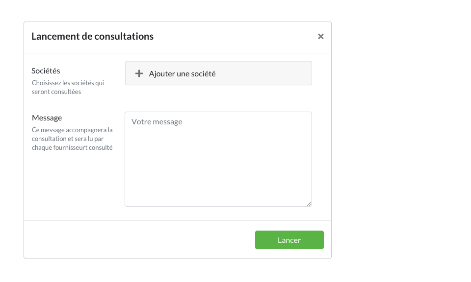
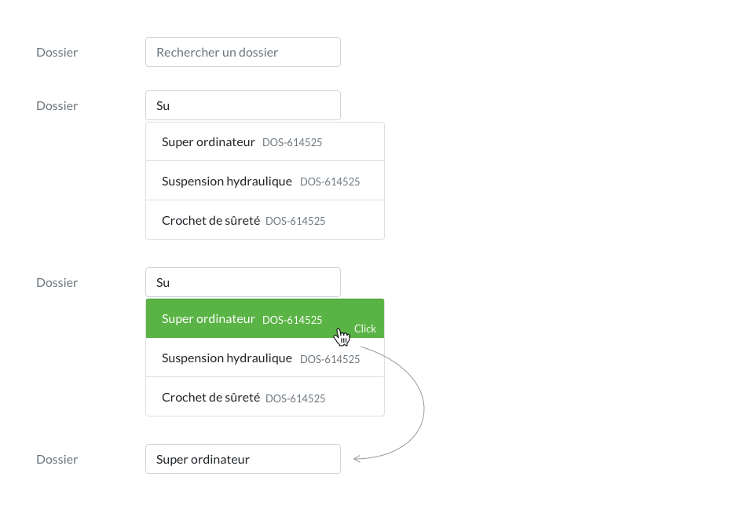

* table of contents
{:toc}

Dès qu'un utilisateur doit ajouter ou modifier des informations, il le fait dans une fenêtre modale. Le changement visuel traduit le changement de posture de l'utilisateur : de cette façon, les actions d'écriture par l'utilisateur sont visuellement séparées des actions de lecture, ou des actions opérées par le système. 

> L'utilisation de la fenêtre modale permet de poser un cadre cohérent à des actions de saisie, et de mutualiser des composants (côté développement) et des façons de faire (côté utilisateur). 

Il permet, dans certains cas particuliers, d'afficher des données en lecture (historique de l'évaluation d'une société *in* [Société](ui.societes.html), accès à une vue statistique dans le [chiffrage d'un dossier](ui.dossiers.html) )

## Types de modales ##

#### Message ####

Les messages pourront être accompagnés d'une icone, qui renseignera l'utilisateur sur le caractère critique d'un message.

	

	    

		

		    

			<h5 class="modal-title mt-0">Modal title</h5>
			<button type="button" class="close" data-dismiss="modal" aria-label="Close">
			    &times;
			</button>
		    

		    

		    

				

					
<i class="ico ico-large">caution</i>

					
Êtes-vous sûr ?

				

			

		    

		    

		<button type="button" class="btn btn-outline-dark">Annuler</button>
			<button type="button" class="btn btn-primary">Modifier</button>
		    

		

	    

	

#### Modification ####

Pour les fenêtres d'ajout/modifications, les labels des `<input>`, `dropdowns` ou `textarea` sont alignés horizontalement avec les champs. Cela permet d'optimiser l'occupation verticale de la fenêtre modale.

Voici, ici, quelques exemples d'intégration des composants de base dans une fenêtre modale.

    

	

	    

		

		    <h5 class="modal-title mt-0">Modifier le dossier</h5>
		    <button type="button" class="close" data-dismiss="modal" aria-label="Close">
			&times;
		    </button>
		

		

		    

			

			    
<label for="input1">Nom</label>

			    
<input type="text" class="form-control" id="input1" value="Super ordinateur">

			

			

			    
<label for="input2">Client</label>

					
<input type="text" class="form-control" id="input2" value="Ingelec">

    
			

			

			    
<label for="input3">Budget</label>
Ce texte d'aide indique que le budget est indiqué en {devise du système}

			    
<input type="text" class="form-control" id="input3" value="50000" style="width: 96px;">

			

			

			    
<label for="input4">Message</label>
Ce message sera lu par l'utilisateur pour indiquer la nature de l'information renseignée ici

			    
<textarea class="form-control" id="input4" rows="5" placeholder="Message"></textarea>

			

			

			    

				

				    <input class="form-check-input" type="checkbox" value="" id="defaultCheck1">
				    <label class="form-check-label" for="defaultCheck1">
					Le label s'affiche tout de suite à droite de cette case à cocher
On affiche le composant et son label dans la même colonne, contrairement aux autres composants de cette modale.

				    </label>
				    
				
			 
			    

			

			
			

			
			

			    

				
On n'hésitera pas non plus à intégrer des séparateurs <code>&lt;hr/&gt;</code>, pour organiser les composants par groupe. Cela permet à l'utilisateur de <strong>comprendre rapidement la logique</strong> de la modale.

			    

			

			
			

			    

<input class="form-check-input" type="radio" name="exampleRadios" id="exampleRadios1" value="option1" checked>
			<label class="form-check-label" for="exampleRadios1">
				Premier choix 
Comme les cases à cocher, le bouton radio et son composant sont affichés dans la même colonne.

</label>
	

	<input class="form-check-input" type="radio" name="exampleRadios" id="exampleRadios2" value="option2">
<label class="form-check-label" for="exampleRadios2">
    Second choix
  </label>

			    

			

			
		    

		    

			<button type="button" class="btn btn-outline-dark">Annuler</button>
			<button type="button" class="btn btn-primary">Modifier</button>
		    

		

	    

	

    

## Erreur dans un formulaire ##

Lorsqu'une erreur est remontée à l'utilisateur après que le formulaire ait été soumis, on utilise :
- [une alerte ](https://getbootstrap.com/docs/4.5/components/alerts/)de type "danger", affichée en haut de la zone de contenu, qui synthétise l'erreur. On veillera à ne pas se contenter de signaler l'erreur, mais on donnera aussi **à l'utilisateur des informations pour la résoudre**
- le label est coloré en `--danger`
- lorsque cela est possible, le champ est entouré par une bordure de couleur `--danger`

    

	

	    

		

		    <h5 class="modal-title mt-0">Modifier le dossier</h5>
		    <button type="button" class="close" data-dismiss="modal" aria-label="Close">
			&times;
		    </button>
		

		

		    

			

			    La valeur de budget est incorrecte : cette valeur ne peut être négative
			

			

			    
<label for="input1">Nom</label>

			    
<input type="text" class="form-control" id="input1" value="Super ordinateur">

			

			

			    
<label for="input2">Client</label>

			    

				

				    <button class="btn btn-light dropdown-toggle" type="button" id="dropdownMenuButton" data-toggle="dropdown" aria-haspopup="true" aria-expanded="false">
					Client name
				    </button>
				    

					<a class="dropdown-item disabled" href="#">Ce composant est détaillé ci-dessous</a>
				    

				

			    

			

			

			    
<label for="input3" style="color: var(--danger);">Budget</label>
Ce texte d'aide indique que le budget est indiqué en {devise du système}

			    
<input type="text" class="form-control" id="input3" value="-50" style="width: 96px; border: 1px solid var(--danger);">

			

		    

		    
		

		

		    <button type="button" class="btn btn-outline-dark">Annuler</button>
		    <button type="button" class="btn btn-primary">Modifier</button>
		

	    

	

    

## Position dans le *viewport* ##

Les modales sont centrées verticalement et horizontalement dans l'écran.

On laissera toujours un espace de `28px` en haut et en bas. Si les informations de la modale font dépasser celle-ci du *viewport*, on doit pouvoir scroller dans la zone de contenu (le header qui contient le titre et le footer qui contient les boutons d'action sont fixes). Ce comportement est [facilement paramétrable avec Bootstrap](https://getbootstrap.com/docs/4.5/components/modal/#vertically-centered).

Parfois, le contenu d'une fenêtre peut être tellement important qu'il impose un *layout* particulier. C'est le cas de la fenêtre de modification d'un utilisateur, qui est séparé en deux colonnes : à gauche, les informations générales, à droite, les droits de l'utilisateur. En agrandissant la modale et en appliquant cette mise en place, on évite à l'utilisateur de nombreux scrolls, et il a un maximum d'information sous les yeux.

## Composants spéciaux ##

Les composants/ensemble de comportements ci-dessous détaillent le principe appliqué lorsque l'utilisateur doit ajouter à un élément un autre élément présent dans le système. 

#### Ajout de plusieurs éléments du système ####

Cet ensemble de comportement permet d'ajouter à un élément, un ou plusieurs autres éléments présents dans le système : lors, par exemple, du lancement d'une consultations, il permet d'y ajouter manuellement plusieurs sociétés.

Déroulons cet exemple, à partir de la fenêtre modale de lancement manuel de consultation.

À partir de là, un champ de recherche accompagné d'un bouton de validation permet à l'utilisateur de chercher les sociétés présentes dans le système. Un premier clic permet de sélectionner la société, et un second sur le bouton de validation permet d'ajouter cette société. Si la société doit être retirée de ce lancement, un lien disponible au survol permet d'effectuer cette action.

#### Ajout d'un élément présent dans le système ####
Cet ensemble de comportement est similaire à la partie précédente, mais, cette fois, un seul élément doit être ajouté. Lors, par exemple, de l'ajout d'un dossier à un élémént en édition/création.

Si un utilisateur veut ajouter un élément non encore présent dans le système, une erreur lui est remontée, et l'action principale ne peut être achevée.

## Animation ##

On veillera à retirer l'animation d'apparition et de disparition de la modale, ceci pour optimiser l'efficacité de l'utilisateur.
[Retirer l'animation](https://getbootstrap.com/docs/4.5/components/modal/#remove-animation)
