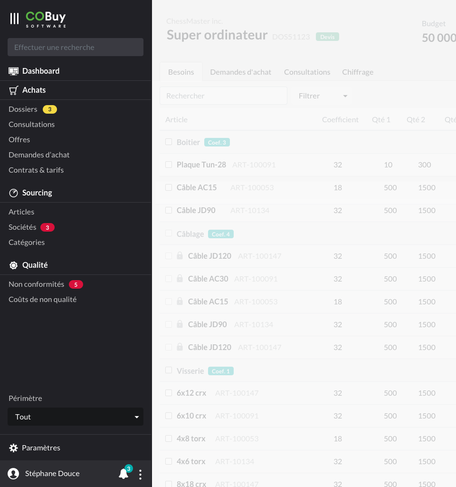
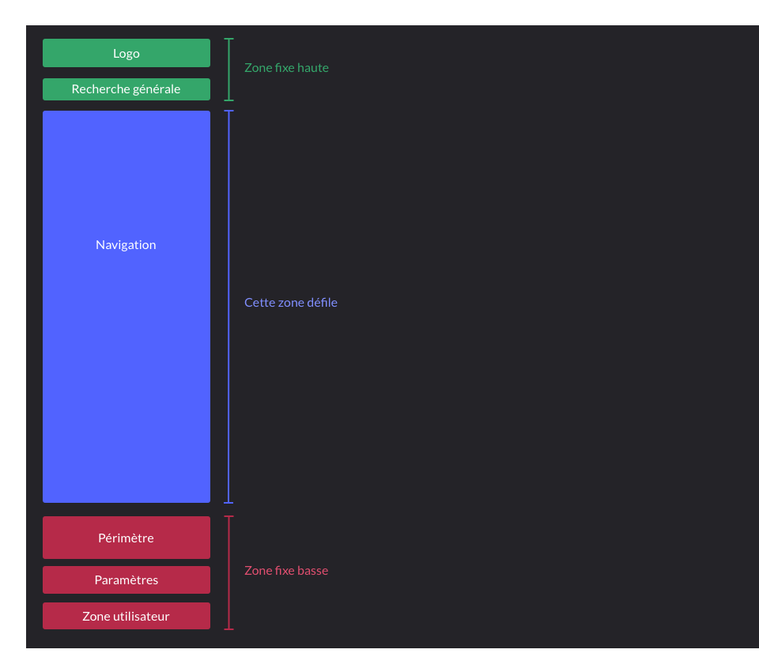
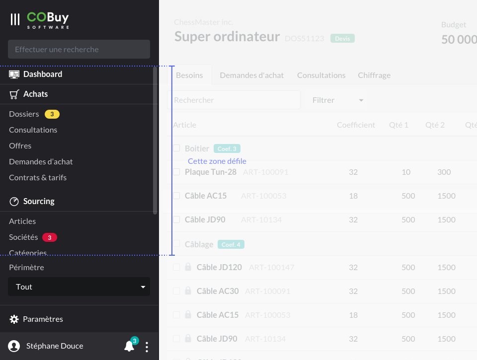
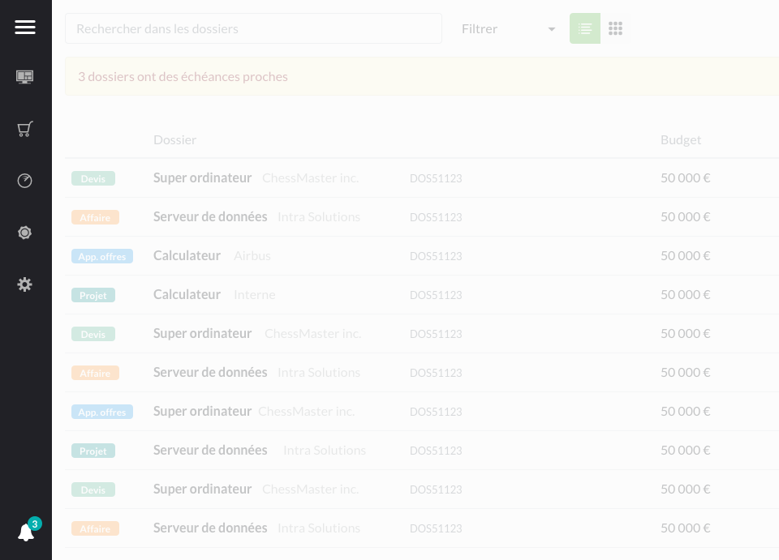
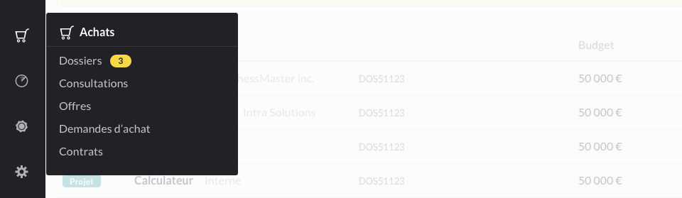

* table of contents
{:toc}

La barre de navigation générale est le point d'entrée de multiples actions dans l'interface. C'est un composant qui sert à :
- Naviguer entre les différents objets
- Effectuer des recherches globales
- Modifier le périmètre des informations disponibles dans l'interface
- Accéder aux paramètres système et aux paramètres utilisateur
- Notifier l'utilisateur

À ce titre, il sera important de particulièrement soigner son aspect et ses interactions, c'est pourquoi les spécifications de celui-ci sont aussi précises. Dans la mesure où ce menu est de fond sombre, il sera nécessaire d'adapter les composants qui y seront intégrés (`input` de la recherche, `dropdown`).

## Règles générales ##
On applique à ce menu un padding de `16px`. 

Le menu prend toute la hauteur de l'écran. Au redimensionnement, le bloc *pied* reste fixe au bas du menu. Si la hauteur du *viewport* est réduite au point de devoir faire défiler une partie du contenu, on fera défiler le bloc d'accès entre le groupe *en-tête* et le groupe `pied`, qui seront toujours visible (`z-index` supérieur).

#### Couleurs ####

Ce nuancier présente les couleurs utilisées dans ce menu.

    

	

	    

		

		

		    
<strong>Fond</strong>

		    
#212126

		

	    

	

	

	    

		

		

		    
<strong>Filets</strong>

		    
#3A3A41

		

	    

	

	

	    

		

		

		    
<strong>Zone utilisateur</strong>

		    
#2D2D32

		

	    

	

	

	    

		

		

		    
<strong>Menu périmètre</strong>

		    
#17181A

		

	    

	

	

	    

		

		

		    
<strong>Filet des items actifs</strong>

		    
--primary

		

	    

	

	

	    

		

		

		    
<strong>Fond des items actifs</strong>

		    
#2F462E

		

	    

	

    

	

	
#### Défilement ####
En cas de réduction du *viewport*, la zone de navigation est réduite, et devient *scrollable*. Les zones *fixe haute* et *fixe basse* sont affichées au premier plan.
  

## Logo ##
Le logo à afficher ici est disponible [dans les fichiers](ressources.fichiers.md)

## Recherche ##
Le composant `input` de la recherche est habillé d'un fond `#3A3A41`. Au focus, le fond blanc par défaut du composant.

> Quelques détails en plus sur la page [Recherche](comp.recherche.html)

## Navigation ##

#### Titres de sections ####
Les titres de sections ne sont pas cliquables. Ils affichent une icone et le libellé de la section.
Le libellé est affiché en gras (`<strong>`) et de couleur `--white`.

On applique une class `ico-medium` à l'icone. Les références utilisées sont :
- `dashboard_screen`
- `caddie_o`
- `radar`
- `quality_seal`

Chaque section est suivie d'un filet de 1px de couleur `#3A3A41`. Ce filet outrepasse la règle de padding évoquée dans les [règles générales](#règles-générales), et vient toucher les bords gauche et droite du composant.

L'élément *Dashboard* est l'exception à ce principe, et il est le seul titre de section qui soit cliquable et activable. On lui appliquera les règles des liens, ci-dessous.

#### Accès ####
Les accès doivent avoir une hauteur finale de `32px` (elle correspond à la totalité de la zone réactive).

Le libellé d'un élément inactif à, par défaut, une opacité de `0.75`. Au `:hover`, cette opacité passe à `1`.

Lorsqu'un accès devient actif, on lui applique un fond de couleur `#2F462E`. Un filet d'une largeur de 4px et de couleur `--primary` est également appliqué. Le libellé a une opacité de `1`.

###### Notifications ######
Un [pill-badge](https://getbootstrap.com/docs/4.5/components/badge/#pill-badges) peut être ajouté directement à droite du libellé. Il est affiché à tous les utilisateurs, et remonte une quantité d'occurences sur lesquelles une action est recommandée. Deux couleurs, `--warning` et `--danger`, sont disponibles pour caractériser la nature de l'alerte.

> Ce badge devrait correspondre à une alerte présente en haut de liste, lors de l'arrivée de l'utilisateur sur la section correspondante. Voir [les alertes dans la section de gabarit de liste](gabarits.listes.html#alerte).

## Périmètre ##
Le menu de périmètre est un [dropdown](https://getbootstrap.com/docs/4.5/components/dropdowns/#dropup) qu'on ouvrira par le haut. La seule personnalisation ici concerne son fond par défaut, qui sera de couleur `#17181A`.

## Paramètres ##
L'accès aux paramètres est un mélange de titres de section et de liens. 

La section est précédée d'un filet de 1px de couleur `#3A3A41`. Ce filet outrepasse la règle de padding évoquée dans les [règles générales](#règles-générales), et vient toucher les bords gauche et droite du composant.

On applique une class `ico-medium` à l'icone. La référence utilisée est `cog`.

## Zone utilisateur ##
Les informations de l'utilisateur sont affichées sur un fond `#2D2D32`. La hauteur de la zone est de `56px`.

Les informations affichées sont :
- une icone `user_circle` ― avec une class `ico-large`
- Le nom de l'utilisateur connecté `
`
- Une icone `bell` (class `ico-large`), avec un [pill-badge](https://getbootstrap.com/docs/4.5/components/badge/#pill-badges) de couleur `--info` ― Voir également dans la section [Animations](ui.animations.html#horloge-de-notifications-de-lutilisateur)
- un menu (icone `dots_v`) donnant accès à un menu avec les options suivantes

  <a class="dropdown-item" href="#">Aide</a>
  <a class="dropdown-item" href="#">Paramètres de compte</a>
  <a class="dropdown-item" href="#">Déconnexion</a>

L'entrée **aide** enverrait vers une documentation du produit, comme évoqué dans le [propos introductif à ces spécifications](index.html). L'entrée **Paramètres** de compte donne accès à des informations propres à l'utilisateur (adresse mail associée, paramètres d'affichage e.g.). L'entrée **Déconnexion** le déconnecte et le renvoie à l'écran de [login](ui.login.html)

#### Notifications utilisateur ####

Voir [Notifications](comp.notifications.html)

## Comportement ##

À la connexion de l'utilisateur, le menu est déplié (visible) par défaut. L'utilisateur peut le réduire en cliquant sur <i class="ico ico-medium">menu_v</i>.

#### Réduction ####
Le menu est alors réduit à une barre verticale de `64px`, de fond `#212126`. Il affiche une icone `menu`, et les quatre icones de sections. Au clic sur l'icone correspondant au dashboard, on accède au dashboard. 

#### Survol ####

Au `:hover` sur *Achats*, *Sourcing* ou *Qualité*, ses accès apparaissent dans un conteneur de fond `#212126`. On appliquera à ce conteneur un léger `border-radius` (`3px`). On reproduit à l'intérieur l'affichage exact de la section correspondante.

#### Retour à l'état initial ####

Au clic sur <i class="ico ico-medium">menu</i>, le menu est "déplié" et revient dans son état initial.

#### Petits écrans ####

En dessous d'une largeur de viewport de  `1440px` de largeur, le menu est par défaut affiché dans sa position "repliée".
