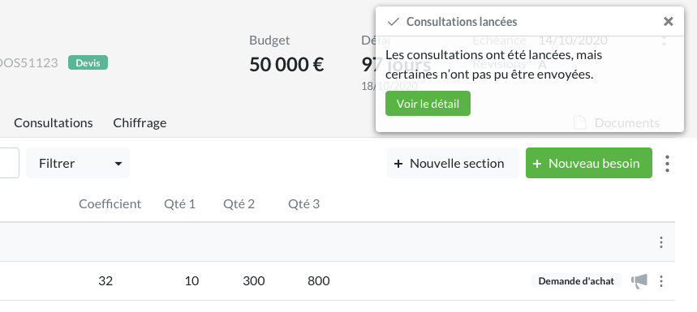
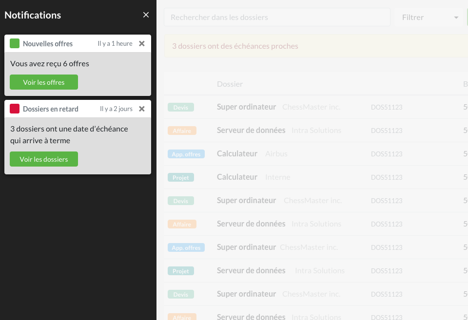

* table of contents
{:toc}

Les notifications sont affichées de deux façons :
- en haut à droite de l'écran, pour informer un utilisateur après une action
- dans la zone de notification utilisateur, pour remonter des informations notables entre deux connexion

Le message sera structuré de la façon suivante : dans l'en-tête, on caractérise le type de message. Dans le corps du composant, on précise la nature de l'information.

## Retour lors d'une action ##
Lors de lancement de consultations, d'envoi de messages, l'utilisateur est averti du bon déroulement de l'action

La notification reste visible 10 secondes à l'écran. Le composant est rémanent (il reste visible, à sa position, si l'utilisateur change d'écran).

Si la notification donne accès à un détail (un problème, principalement), celui-ci sera consultable *via* une [fenêtre modale](comp.modales.html). On sera, dans cette fenêtre, plus explicite quant à la nature du problème, et plus verbeux.

#### Exemples ####

    

	<i class="ico ico-large mr-2" style="color:#5AB445;">paper_plane</i>
	<strong class="mr-auto">Envoi réussi</strong>
	<button type="button" class="ml-2 mb-1 close" data-dismiss="toast" aria-label="Close">
	    &times;
	</button>
    

    

	Le message a bien été envoyé à Jean Fournier
    

    

	<i class="ico ico-large mr-2" style="color:#D8113B;">caution</i>
	<strong class="mr-auto">Problème d'envoi</strong>
	<button type="button" class="ml-2 mb-1 close" data-dismiss="toast" aria-label="Close">
	    &times;
	</button>
    

    

	Il y a eu un problème lors de l'envoi des consultations  
	<button type="button" class="btn btn-outline-danger btn-sm">Voir le détail</button>
    

## Zone utilisateur ##
La notification _utilisateur_ se distingue de la notification _système_, qui est présente sous la forme d'un badge, dans la sidebar, au niveau de l'item ― dossiers, articles, offres, etc.

La notification _utilisateur_ se présente dans une zone dédiée apparaissant au clic sur l'icone `bell`, près du nom de l'utilisateur. Le menu est remplacé par une ou plusieurs notification empilées, qui apparaissent à l'utilisateur entre deux connexions au système : elles l'avertissent d'un changement d'état d'un objet du système, comme un retard sur un dossier ou une nouvelle non conformité. Cet accès bénéficie d'une [animation](ui.animations.html) permettant d'attirer l'oeil de l'utilisateur.

Dans chaque notification, un bouton permet d'accéder aux éléments mentionnés (gabarit [liste](gabarits.listes.html)), et la liste affichée pourra être filtrée pour n'afficher qu'eux.

 
> On se concentrera sur des informations qui sont visibles au niveau de la liste (retard e.g.), l'idée étant de ne pas surcharger l'utilisateur de messages, afin que cette zone de notification conserve un intérêt au fil du temps.

les notifications s'empilent, et ont une durée de vie de 15 jours (sans action de la part de l'utilisateur, cette valeur pouvant être ajustée en fonction du volume). à quelque action de l'utilisateur (clic détails ou croix), la notification disparait de l'espace dédié.

#### Exemples ####

    

	<i class="ico ico-large mr-2" style="color:#5AB445;">check</i>
	<strong class="mr-auto">Nouvelles offres</strong>
	<small>Il y a 3 min.</small>
	<button type="button" class="ml-2 mb-1 close" data-dismiss="toast" aria-label="Close">
	    &times;
	</button>
    

    

	3 nouvelles offres reçues  
	<button type="button" class="btn btn-primary btn-sm">Voir les offres</button>
    

    

	<i class="ico ico-large mr-2" style="color:#D8113B;">caution</i>
	<strong class="mr-auto">Dossiers en retard</strong>
	<small>Hier</small>
	<button type="button" class="ml-2 mb-1 close" data-dismiss="toast" aria-label="Close">
	    &times;
	</button>
    

    

	Il y a 1 dossier en retard  
	<button type="button" class="btn btn-primary btn-sm">Voir le dossier</button>
    

