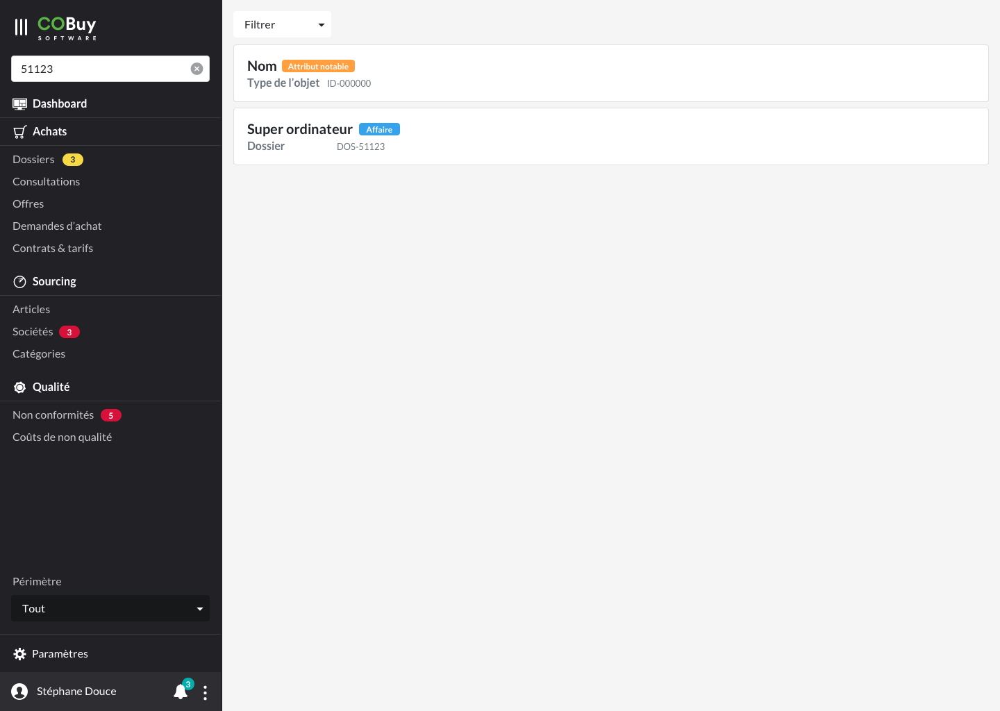

* table of contents
{:toc}

La recherche globale, à l'échelle de toute l'application, est accessible à partir de la navigation principale, et permet de rechercher dans l'ensemble des objets du système. 

#### Description ####

Dès que l'utilisateur entre le premier caractère dans le champ, toute la zone principale est remplacée par les résultats de la recherche.

Directement au dessus des résultats, on affiche un menu déroulant qui permet de filtrer les résultats : idéalement, on l'utilisateur peut les filtrer par type d'objet, mais d'autres caractéristiques peuvent être ajoutées. Il sera important de garder ce menu déroulant organisé, et d'utiliser des séparateurs pour séparer les filtres qui agissent sur l'objet de ceux qui pourraient agir sur d'autres paramètres (e.g. une date, une notification).

Au clic sur la croix (icone `cross_circle`), présente dans le champ de recherche, l'utilisateur retrouve dans la zone principale le dernier écran affiché.

#### Résultat ####

    

	<h5 class="card-title mt-0 font-weight-bold">Nom du résultatAttribut notable</h5>
	<h6 class="card-subtitle mb-2 text-muted">Type de l'objet ID-00000</h6>
    

Chaque résultat est remonté sous la forme de cartes avec titre et sous-titre. Le titre prendra le nom principal de l'objet, et le sous-titre sera le type de cet objet ― dossier, article, offres, etc.

On essaiera de remonter également les informations qui peuvent être nécessaires pour discriminer les résultats. Dans l'exemple donné, il a été choisi de remonter le type de dossier (affaire, appel d'offres, etc.), ainsi que l'identifiant.

#### Éléments ####

- croix : `cross_circle`
- carte (bootstrap)
- input (bootstrap)
- dropdown (bootstrap)
