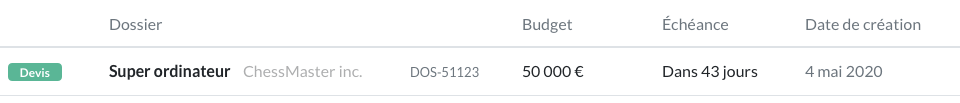
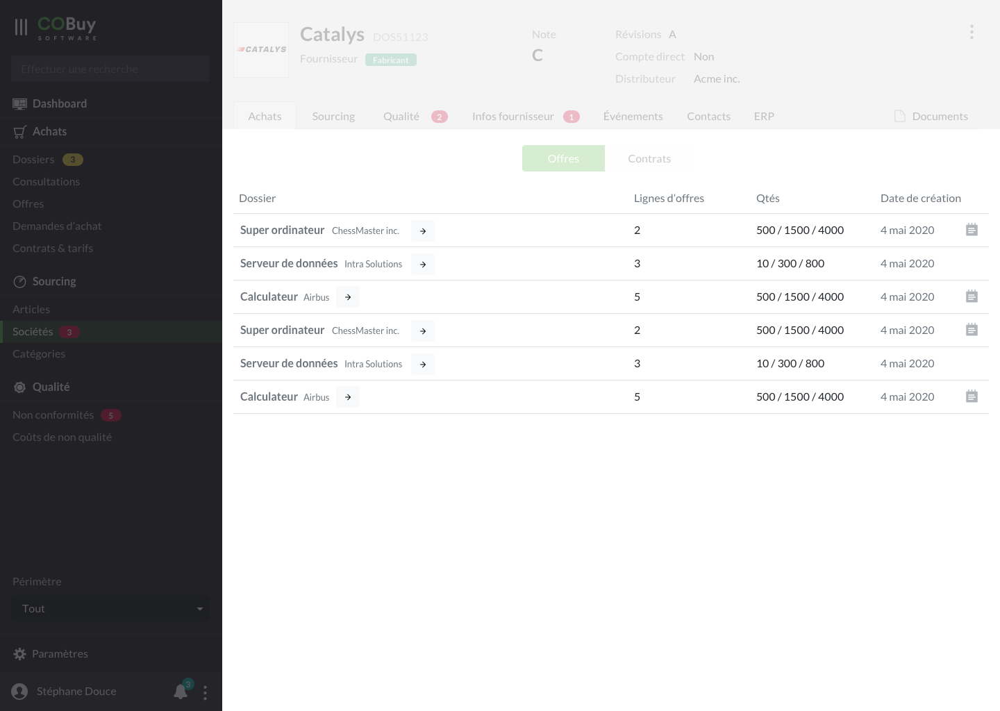
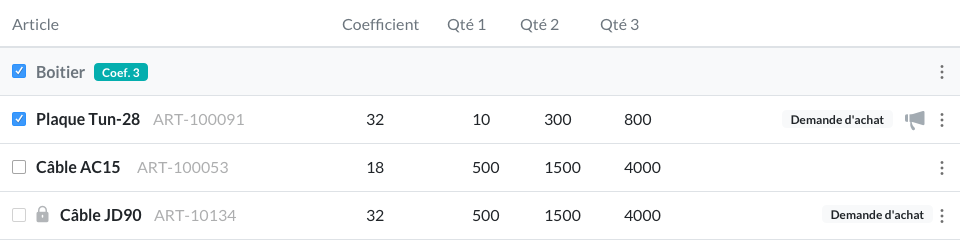
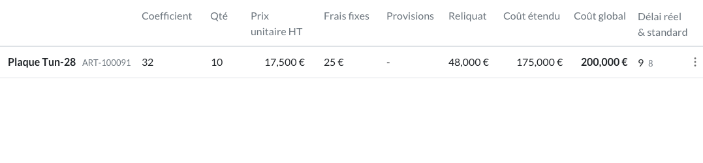
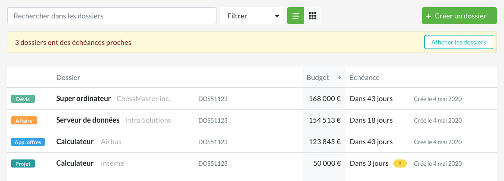

* table of contents
{:toc}

La vue tableau est utilisé dans plusieurs endroits de l'interface, et remonte une quantité différente d'informations en fonction du contexte

## Base ##

Pour chacun de ces affichages, on utilsera le composant [tableau](https://getbootstrap.com/docs/4.5/content/tables/) de Bootstrap. On appliquera une classe `text-muted` aux en-têtes.

On utilisera différents éléments dans chaque ligne de tableau, qui permettront de caractériser et de hiérarchiser l'information

## Utilisations ##

#### utilisation en liste ####

Voir la page du [gabarit de liste](gabarits.listes.html#vue-tableau)

#### reprise d'une vue tableau en sous-catégorie d'un objet ####

Les tableaux sont également utilisés au sein du détail d'un élément (une liste de demandes d'achat dans un dossier e.g.). On utilisera le même composant, auquel on aura retiré quelques informations non nécessaires.

> **Exemple**
> 
> Dans une liste de demandes d'achat intégrée au sein d'un élément *dossier*, on retire les colonnes *client* ou *nom de dossier*, informations déjà présentes dans l'en-tête de page). 
>
> Dans le cas exposé ici, c'est l'architecture de l'écran qui établit la relation entre les données. Ainsi, **toute redondance d'informations peut créer un doute chez l'utilisateur quant à la nature de la donnée qu'il a sous les yeux**, car elle remet en cause la relation hiérarchique de ces éléments.

#### Vue dédiée pour les besoins et le chiffrage d'un dossier ####

###### Besoins ######

###### Chiffrage ######

En plus des principes évoqués ici, ces éléments de l'objet *dossier* auront des besoins spécifiques. Ces besoins sont développés dans la section [dossier](ui.dossier.html)

## Tri des colonnes ##

Au clic sur l'en-tête d'une colonne, le tableau est trié en fonction de celle-ci. Le comportement de l'en-tête est un comportement de *toggle*, et on alterne donc entre un tri *descendant* et un tri *ascendant*. Pour un tri descendant, on affiche à côté de l'en-tête une icone `arrowdown`. Pour un tri ascendant, on affiche une icone `arrowup`.

Les cellules de la colonne qui contrôle le tri du tableau sont alors colorées avec `--light`.

Le comportement proposé pour les tableaux est celui évoqué dans la [section *défilement* du gabarit de listes](gabarits.listes.html#défilement). Les résultats sont chargés à mesure que l'utilisateur fait défiler le tableau (*lazy loading*). On note tout de même que **lors d'un tri, on évaluera toutes les données du tableau, et pas seuelement celles qui ont déjà été affichées**

## Alignement des textes ##
Les données textuelles sont alignés à gauche (`text-align: left;`). 

Les données chiffrées sont, quant à elle, alignées sur leur droite (`text-align: right;`), ce qui permet à l'utilisateur de discriminer beaucoup mieux une quantité de lignes contenant de telles données

## Actions ##
Le tableau propose deux comportements au clic sur une ligne :
- Dans une liste, un clic sur n'importe quel endroit de la ligne renvoie vers l'élément associé. C'est le comportement le plus utilisé
- Quand une ligne de tableau embarque plusieurs actions, comme dans le cas d'une liste de besoin ou d'un chiffrage, on embarque celle-ci dans une menu (icon `dots_v`) aligné à droite. Dans ce cas de figure, le clic sur la ligne n'envoie nulle part, et cet accès, s'il doit être proposé, l'est dans le menu d'actions

