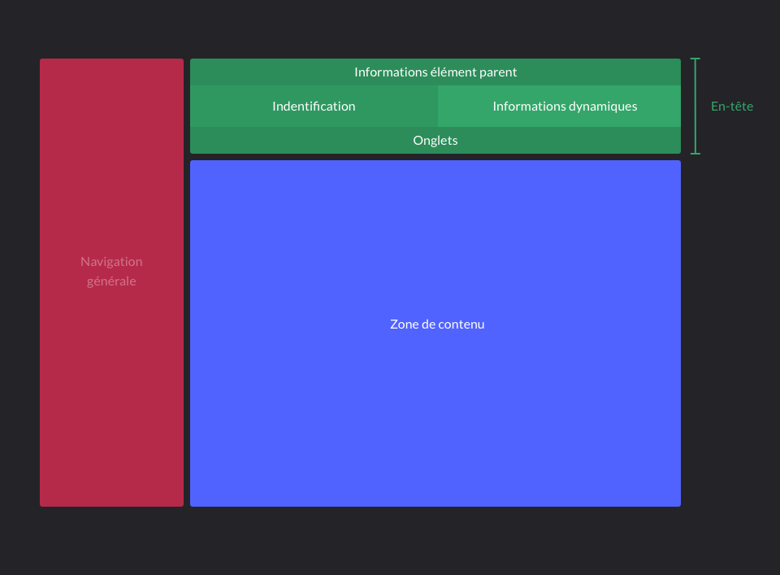
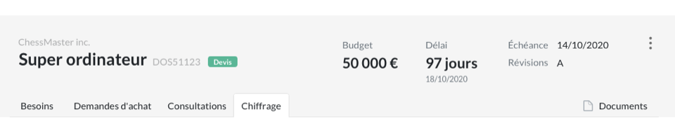
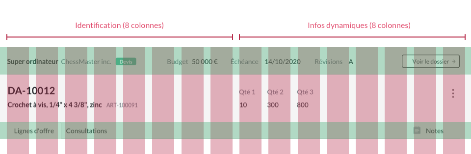
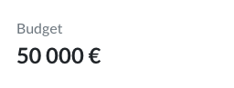
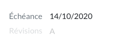
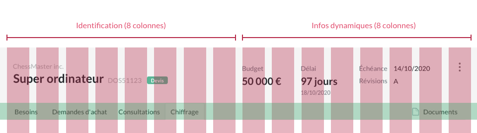
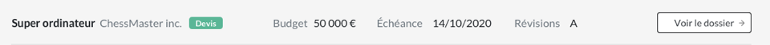
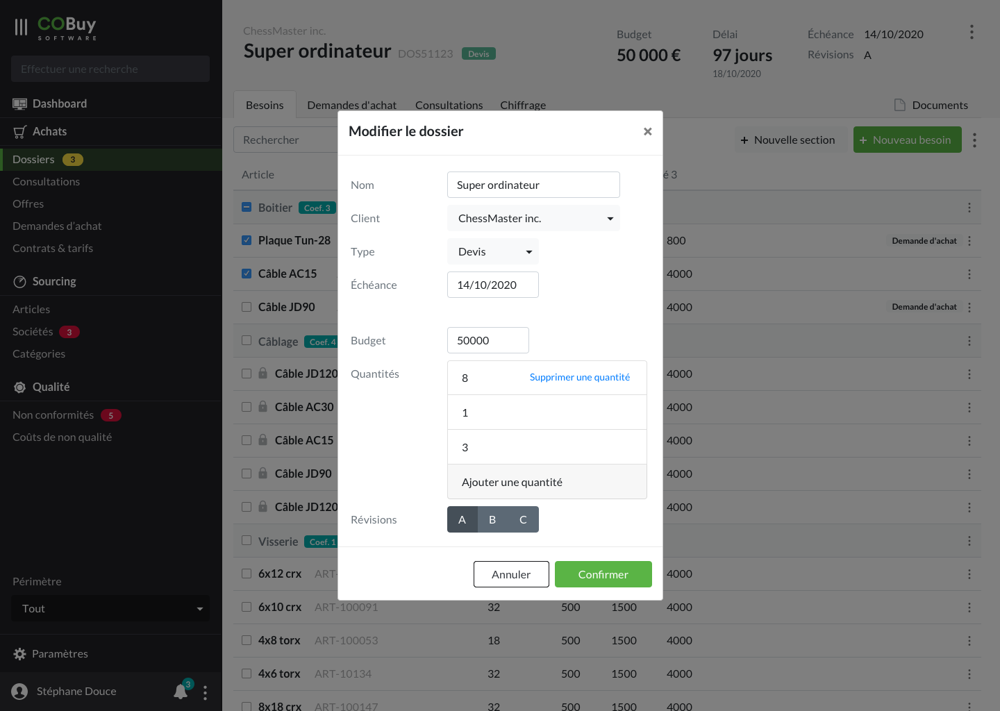
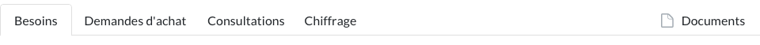
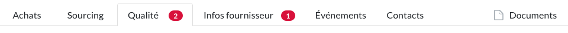

* table of contents
{:toc}

Ce gabarit d'écran est celui qui sera utilisé pour l'affichage d'une occurence d'un objet, comme un dossier, un article, une société, etc.

## Zoning ##

## En-tête ##

Le principe de l'en-tête est d'avoir toujours sous les yeux, où que l'on soit dans ses sous-parties, aux informations principales de l'objet affiché, et de pouvoir avoir rapidement accès, à la possibilité de modifier les informations générales de cet objet.

Cette partie est fixe, c'est à dire que tout défilement dans la page ne fait pas sortir ce composant du *viewport*. 

Ce composant affiche trois informations principales :
- l'identification de l'élément affiché
- des informations dynamiques (date, coût)
- l'accès à la modification de l'élément
- les informations d'un élément parent

#### Identification ####

Décomposé en deux parties
Sur 8 colonnes, on trouve l'identité de l'objet :
- son nom `<h3>`
- des informations parentes (un nom de client) `
`
- le type de l'objet, éventuellement affiché avec un [pill-badge<i class="ico">external_link</i>](https://getbootstrap.com/docs/4.5/components/badge/#pill-badges)
- l'identifiant (ID00000) `
`

#### Informations dynamiques ####
Sur les 8 colonnes suivantes, on retrouvera des informations qui pourront être par nature plus dynamiques, comme une échéance, un budget, etc.
Il y a deux façons de traiter une de ces données dynamiques. 

Si la donnée est centrale (*e.g.* le budget d'un dossier), on l'affichera sur **2 colonnes** de la façon suivante :

- libellé `
`
- en dessous : la valeur `<h3>` ou `
`

Pour toute autre information, on affichera l'information *inline*, sur **3 à 4 colonnes**
- libellé `
` 
- *inline*, la valeur `
`

#### Exemple : un dossier ####

Décomposé en deux parties
Sur 8 colonnes, on trouve groupés :
- le nom du client `
`
- le nom du dossier affiché `<h3>`
- le numéro de référence du dossier affiché `
`
- le type du dossier (affiché dans un badge)

Sur les 8 colonnes suivantes, on affiche les informations de budget, de délai, ainsi que l'échéance et les révisions. Ces informations n'ont pas la même importance, aussi nous pouvons les traiter de deux façons différentes :
- Sur 2 colonnes chacun, on affiche budget et délai
  - le libellé avec `
`
  - la valeur avec `<h3>`
  - éventuellement, une information en `
` (ici, la )

La dernière colonne sert à placer le bouton d'accès à la modification de l'élément (icone `dots_v`)

#### Alerte ####
Il est parfois nécessaire de remonter une information de premier ordre sur un élément. On utilisera pour cela, comme dans les listes, un élément Alerte, qui sera placé entre les informations générales de l'élément, et les onglets de sous-navigation.

[capture]

#### Informations d'un élément parent ####

Comme les objets ont une interdépendance forte (une demande d'achat, une consultation ou une offre est liée à un dossier), il y a dans les cartes des objet qui dépendetn d'un parent (e.g. une consultation), un lien et une synthèse d'information de l'objet parent (un dossier)

On reprend alors, dans la partie haute de l'en-tête, les informations principales liés à ce parent. On ajoute également un lien qui permet de revenir vers celui-ci.

Tous les éléments sont alignés horizontalement sur une bande de `64px` de hauteur.

Dans le cas d'un dossier, on affiche les éléments suivants :
- Un premier groupe d'information reprend les informations principales
  - Nom du dossier `
<strong>`
  - Le nom du client `
`
  - Un badge affichant le type du dossier (affaire, appel d’offres, devis ou projet) (badge). Chaque caractéristique prendra une des couleurs personnalisés
- Un second groupe les informations secondaires
  - pour chacune, on affiche le libellé avec `
` et la valeur avec `
`
- Enfin, on ajoute un [bouton de style outline<i class="ico">external_link</i>](https://getbootstrap.com/docs/4.5/components/buttons/#outline-buttons), accompagné d'une icone `arrowright`, qui permet d'accéder au dossier

On tâchera de séparer par un espace plus important (`64px` min. dans l'idéal) ces trois groupes de données (principales, secondaires, accès).

Pour le rappel d'une non conformité (dans le détail d'une non-qualité), le principe est le même, l'information principale étant simplement composée du non de la non conformité `
<strong>`

On sépare le rappel de l'objet parent des informations de l'élément par une ligne d'1 px de couleur `#DFDFDF`.

#### Modification du contenu ####

Un clic sur l'icone présente en haut à droite de l'en-tête (icone `dots_v`) donne accès aux options de modifications du contenu. Deux options sont accessibles.

  <a class="dropdown-item" href="#">Modifier</a>
  <a class="dropdown-item" href="#">Clôturer</a>

Le clic sur l'option `Modifier` ouvre une [fenêtre modale](comp.modales.html) qui donne accès à l'édition des informations générales de l'élément.

## Onglets ##

[Les onglets<i class="ico">external_link</i>](https://getbootstrap.com/docs/4.5/components/navs/#tabs) permettent de naviguer au sein de chaque objet (voir Naviguer).

Les informations provenant d'autres objets sont alignés à gauche. Ils peuvent accueillir un [*pill-badge*<i class="ico">external_link</i>](https://getbootstrap.com/docs/4.5/components/badge/#pill-badges) qui leur permet de remonter une quantité d'éléments notables sous cet onglet.

Les éléments _joints_ (notes ou documents) sont quant à eux alignés sur la droite. Les libellés de ces onglets sont accompagnés d'une icône ― `notes` et `file_o`.

## Zone de contenu ##

Les zones dont l'affichage est contrôlé par les onglets sont développées dans les sections correspondantes ([dossiers](ui.dossiers.html), [sociétés](ui.societes.html), [articles](ui.articles.html), etc.).

Si cette zone de contenu affiche un nouveau niveau de navigation, on utilise un composant [*button group*<i class="ico">external_link</i>](https://getbootstrap.com/docs/4.5/components/button-group/#basic-example) pour contrôler l'affichage.
