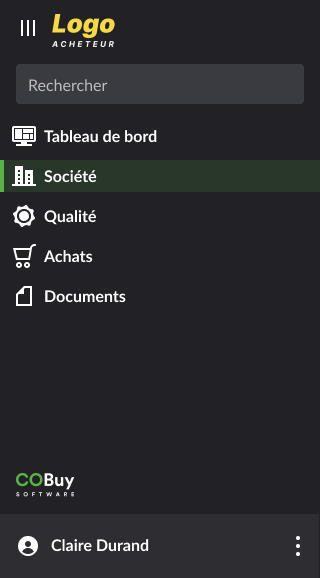
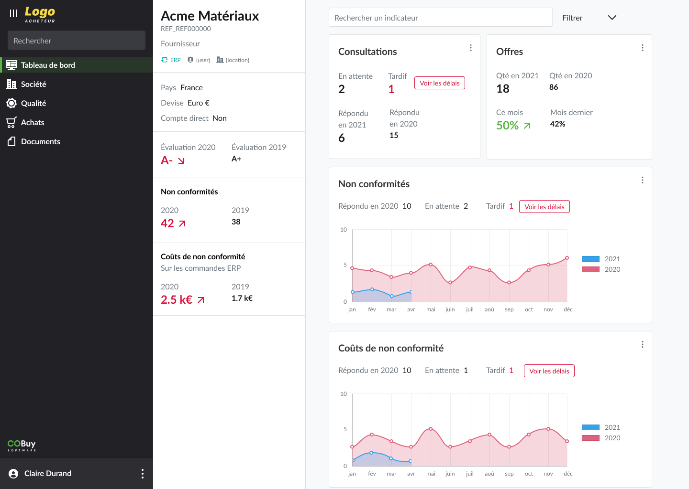
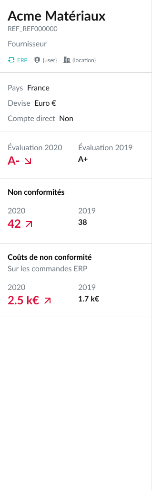
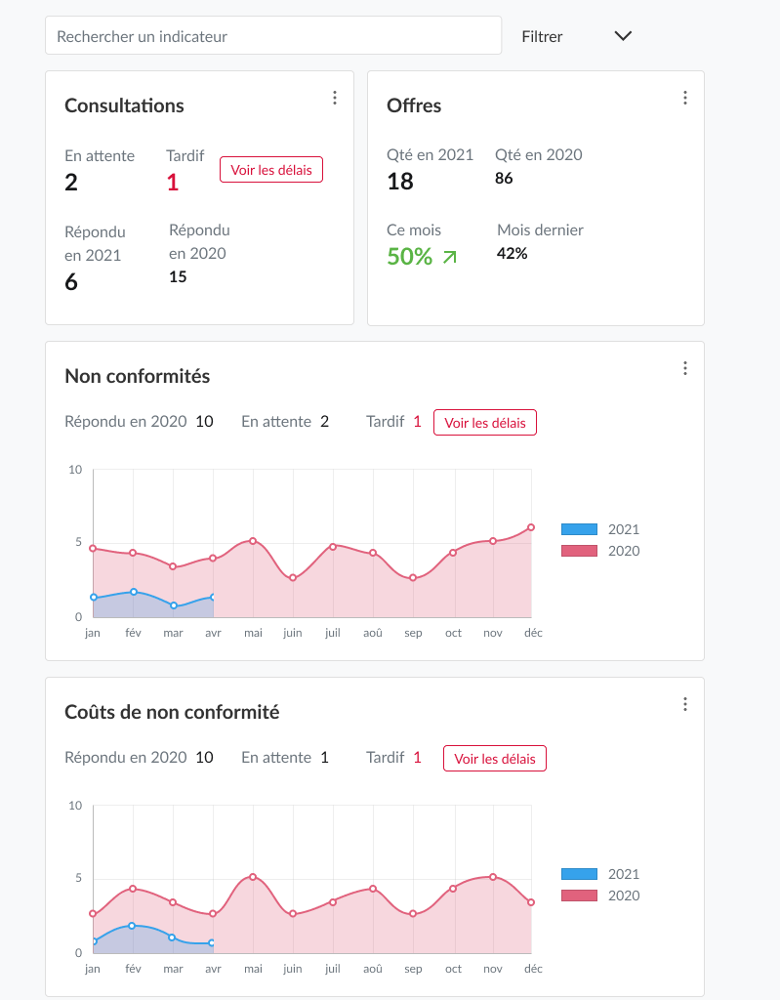
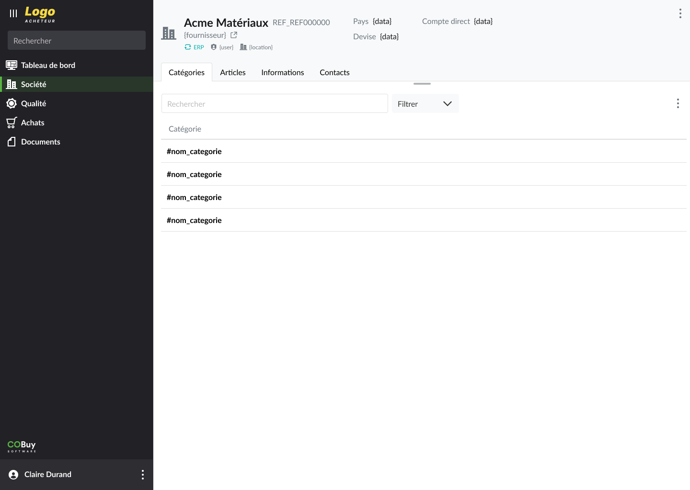
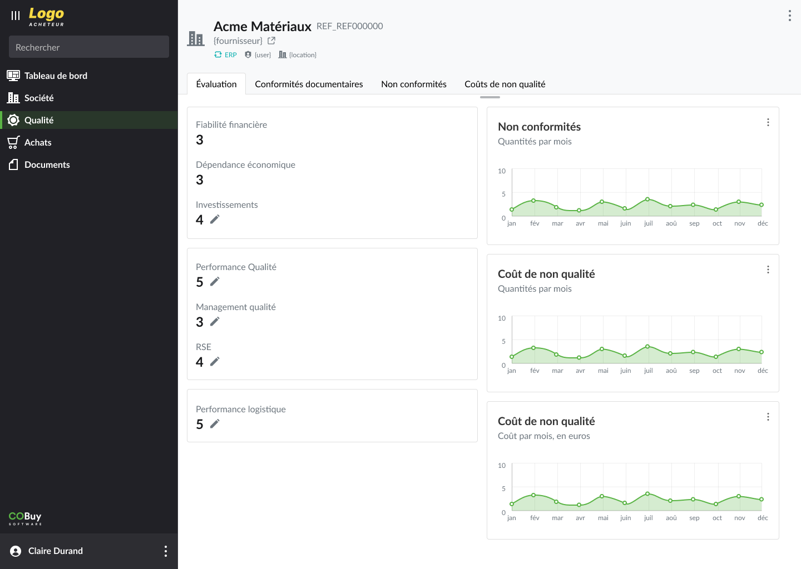
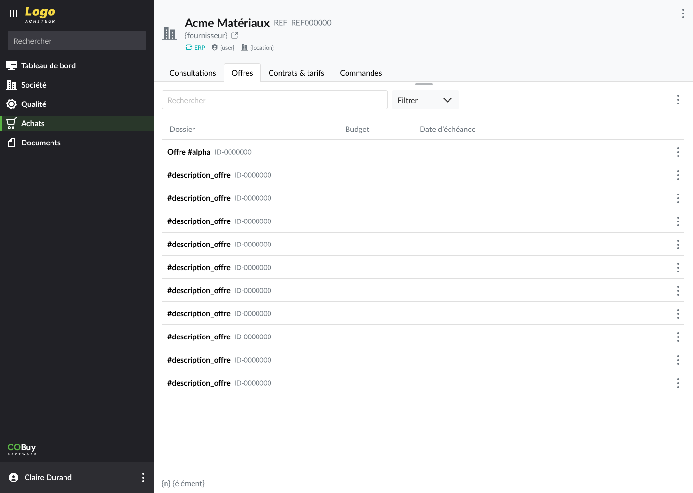
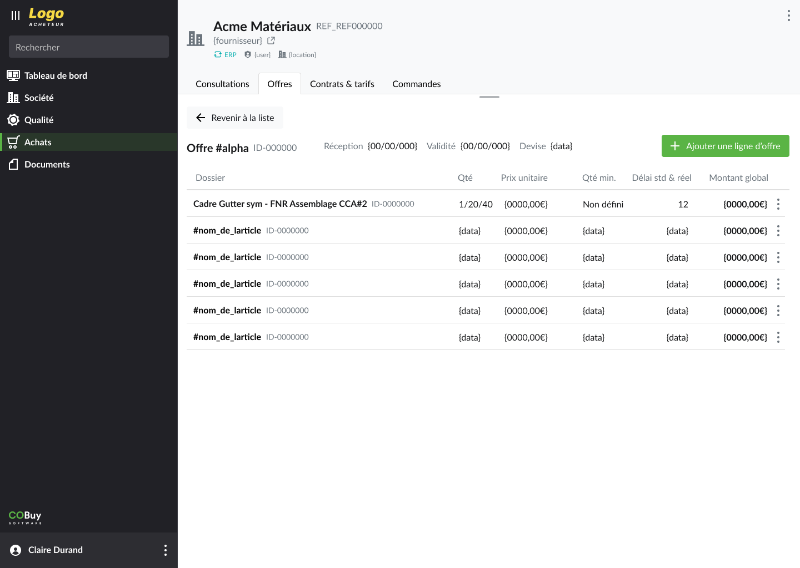
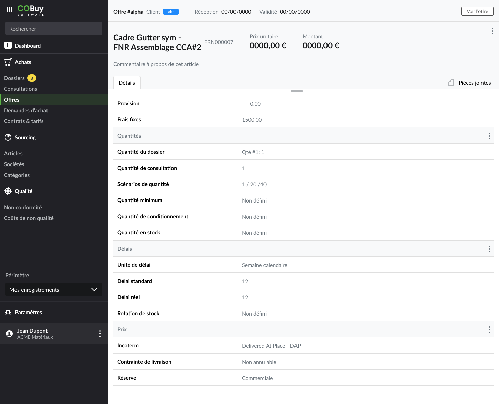
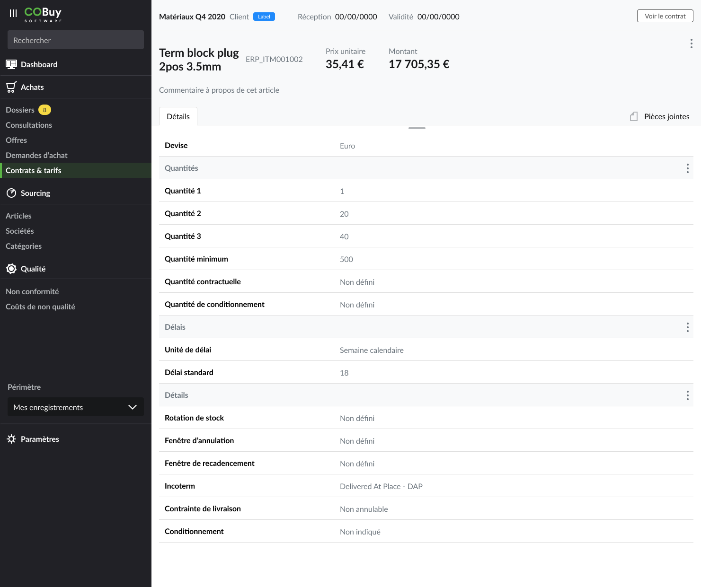

* table of contents
{:toc}

Les travaux sur l'UX du sprint 3 portent sur le **portail fournisseur** et sur les vues de **détail des lignes d'offres et de consultations**.
	
## Portail ##
Le rôle du portail est de proposer au fournisseur une vue des données le concernant. L'application proposée est une reprise de celle présente du côté de l'acheteur. Elle comporte moins de possibilités, la plupart des informations n'étant proposées qu'en lecture.

### Navigation ###
La navigation est adaptée et simplifiée. L'en-tête affiche le logo de l'acheteur. La marque *Cobuy* est reprise en bas de la navigation, juste au dessus de la partie `Utilisateur`.



Les entrées `Tableau de bord`, `Société` et `Qualité` affichent directement les pages correspondantes.

Ce n'est pas le cas des entrées sous `Achats`, où l'utilisateur passera par une [vue Liste](gabarits.listes.html) : on doit donc afficher l'arbre à cet endroit. Cela est nécessaire pour ne pas introduire de lourdeur au niveau de la navigation.

### Tableau de bord ###



Dans le tableau de bord, deux espaces distincts cohabitent. 
- Une colonne de gauche, qui affiche 
  - **les informations principales** du fournisseur (Nom, id Cobuy, type de fournisseur etc.)
  - **des données statiques** (fermées). On y retrouve les évaluations de l'année n et n-1, ainsi que les non conformités et les coûts de non conformité. Toute donnée fermée trouvera ici sa place.
- Un espace central qui affiche **des indicateurs dynamiques** ; les données sont mises à jour régulièrement. Elles peuvent être, pour comparaison, superposées avec des données n-1

##### Colonne de gauche #####

Un exemple de colonne de gauche, affichant des informations générales et de la donnée statique.



##### Zone centrale #####

L'espace central affiche tous les indicateurs dynamiques, pour la période actuelle. Un clic sur chaque carte renvoie l'utilisateur vers la vue correspondante dans le portail ([voir le prototype](sprints.s3-2021.html#lien-prototype)).



> **Rappel sur le *wording***
>
> Attention à donner des libellés qui soient clairs pour l'utilisateur. Ainsi, on préférera intituler des libellés comme *Non conformités en 2021* ou *Offres en 2020* plutôt que *Donnée n* ou *Donnée n-1*<br/>
> Ce qui est évoqué [ici pour les actions](ux.ergonomie-recommandations.html#actions) vaut pour tous les libellés : **"l’interface utilisateur essaie de parler un langage humain (…)"**, où l'information doit s'offrir avec un minimum d'effort de compréhension pour l'utilisateur.

### Société, Qualité ###

Le principe général du gabarit [Détails](gabarits.details.html) est utilisé.

Dans l'[*en-tête*](gabarits.details.html#en-tête) de la vue détail de la section *Société*, les informations principales du fournisseur actif sont reprises (nom, id cobuy, type de fournisseur). Sur la partie droite de l'en-tête, on affiche les informations générales déjà présentes sur le [tableau de bord](sprints.s3-2021.html#colonne-de-gauche). 



Le principe est similaire our la section *Qualité*, sans les informations générales telles que `pays`, `devise`, etc.



> On déterminera s'il est nécessaire d'afficher au fournisseur les informations *ERP*, *Utilisateur* ou *site*, ces informations internes à l'acheteur n'étant pas forcément pertinentes ou nécessaires pour le fournisseur.

### Achats ###
L'arbre de navigation est donc déployé, et toute la section est structuré sur le principe suivant 

```text
+--------+       +-------------+       +--------------+       +---------------+
|  MENU  |  ==>  |  VUE LISTE  |  ==>  |  VUE DÉTAIL  |  ==>  |  VUE LIGNE *  |
+--------+       +-------------+       +--------------+       +---------------+

* Dans le case d'une ligne d'offre ou de contrat e.g.
```

L'item Achats n'est pas cliquable, ce sont ses sous-entrées qui affichent les listes correspondantes (voir le [prototype](sprints.s3-2021.html#lien-prototype)). On veillera, dans les listes, à retirer les colonnes fournisseur, et d'une manière générale toutes les données qui doublonnent et n'ont pas de sens dans ce contexte de portail fournisseur (les données ne concernant qu'un seul et unique founisseur).

L'exemple d'accès aux pages de [détails](gabarits.details.html) est donné pour l'entrée `Offres` du menu.

##### Principe #####
###### Vue liste ######
La liste affiche toutes les offres soumises par le fournisseur




###### Vue détail ######
Au clic sur une offre, on affiche celle-ci, ainsi que son détail (ici, ses lignes d'offre)




###### Vue ligne ######
Au clic sur une ligne d'offre, la vue de détail de la ligne est affiché (voir le détail dans le paragraphe suivant).


## Nouveau gabarit *Ligne* ##
Les lignes (d'offres, de contrats, voire de commandes) nécessitent la création d'un nouveau gabarit. Ce gabarit permettra de consulter les informations de chaque ligne dans une vue, et avec une URL, dédiées.

Le gabarit est structuré de la façon suivante.
- [Un renvoi](gabarits.details.html#informations-dun-élément-parent), en haut, permet à tout moment de revenir vers le contrat ou l'offre d'où vient la ligne en cours de consultation
- Ensuite, l'en-tête intègre les informations principales : 
  - Le nom de l'article correspondant à la ligne (ainsi que l'id Cobuy associé)
  - prix unitaire + montant
- Puis la zone de contenu principale
  - les lignes d'information sont réparties en sections, séparés par une ligne affichant le titre de la section (selon un principe [déjà utilisé dans les dossiers](vue-dédiée-pour-les-besoins-et-le-chiffrage-dun-dossier))
  - Les données sont regroupées par type d'information (prix, délai, stockage, etc.). Les exemples sont donnés plus bas, pour les lignes d'offre et de contrat

##### Détail d'une ligne d'offre #####


##### Détail d'une ligne de contrat #####


## Lien prototype ##
Toutes ces modifications sont [consultables dans le prototype](https://www.figma.com/proto/i5jtbAaIPN3Xq4u5Cg7qvv/%C3%89volutions-2021?node-id=352%3A107808&scaling=min-zoom&page-id=312%3A44665).
