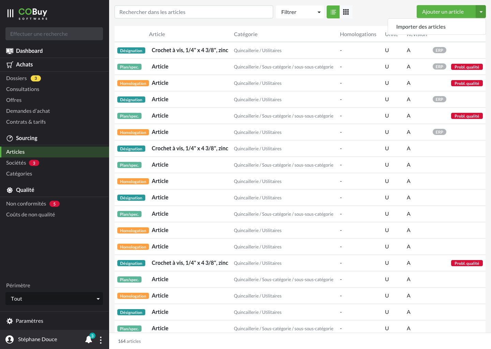
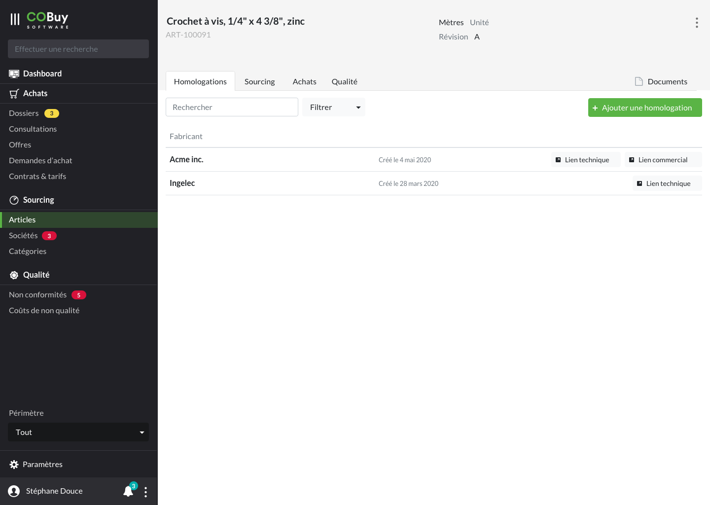

* table of contents
{:toc}

## Liste ##

Au clic sur la section dans la navigation principale, on affiche la liste des offres en cours.

Cet écran utilise les spécifications du [gabarit d'écran de liste](gabarits.listes.html)

Chaque ligne du tableau remonte, par défaut, ces informations
- un badge affichant le type de l'article. Le fond du badge est coloré avec les [couleurs supplémentaires](comp.couleurs.html) 
- Le nom de l'article `
<strong/>`
- La catégorie `
`
- L'homologation `
`
- L'unité du produit `
`
- La révision `
`
- Un [pill-badge<i class="ico">external_link</i>](https://getbootstrap.com/docs/4.5/components/badge/#pill-badges) avec un fond `--light-grey` indiquant si la donnée provient de l'ERP
- Un [badge<i class="ico">external_link</i>](https://getbootstrap.com/docs/4.5/components/badge) avec un fond `--danger` si l'article a un problème qualité

Un badge doté d'un fond `--warning` et contenant un `!` sera affiché sur les dossiers présentant un retard qui doit être remonté à l'utilisateur.

> Comme stipulé dans la [section Listes](gabarits.listes.html), il n'est pas nécessaire de nommer chaque colonne.

#### Recherche contextuelle ####
La recherche contextuelle fonctionne sur le modèle défini dans les spécifications du [gabarit d'écran de liste](gabarits.listes.html#zone-de-recherchefiltrage-et-actions-principales)

Le menu déroulant du filtre pourra être composé des options suivantes (ces options pourront être revus ou affinés en fonction des besoins):

  <a class="dropdown-item" href="#">Désignation</a>
  <a class="dropdown-item" href="#">Plan/spécifications</a>
  <a class="dropdown-item" href="#">Homologation</a>
  

  <a class="dropdown-item" href="#">Donnée ERP</a>
    

  <a class="dropdown-item" href="#">Problème qualité en cours</a>

## Détail ##

#### En-tête ####

Un rappel du dossier parent est affiché en haut de l'en-tête.

Dans la zone de l'offre, les informations de **budget** et de **délai** sont mises en avant.

> Plus de détails dans les [spécifications de l'en-tête](gabarits.details#en-tête.html)

#### Onglets ####

###### Homologations ######

Reprise de liste, vue [tableau](comp.tableaux.html) affichant les homologations liées à l'occurence de l'article.

###### Sourcing ######

Reprise de liste, vue [tableau](comp.tableaux.html) affichant les catégories de l'article.

###### Achats ######

Cette partie affiche une [navigation de troisième niveau](ux.synthese.html#navigation-de-troisième-niveau), avec les entrées *offres* et *contrats*

- Pour offres : reprise de liste, vue [tableau](comp.tableaux.html) affichant les [offres](ui.offres.html) liés à l'occurence d'article.
- Pour contrats : reprise de liste, vue [tableau](comp.tableaux.html) affichant les [contrats](ui.offres.html) liés à l'occurence d'article.

###### Qualité ######

Reprise de liste, vue [tableau](comp.tableaux.html) affichant les [non conformités](ui.non-conformite.html) liés à l'occurence d'article.

###### Documents ######

Voir Documents dans [Documents, messages, notes](comp.docs-messages-notes.html)
