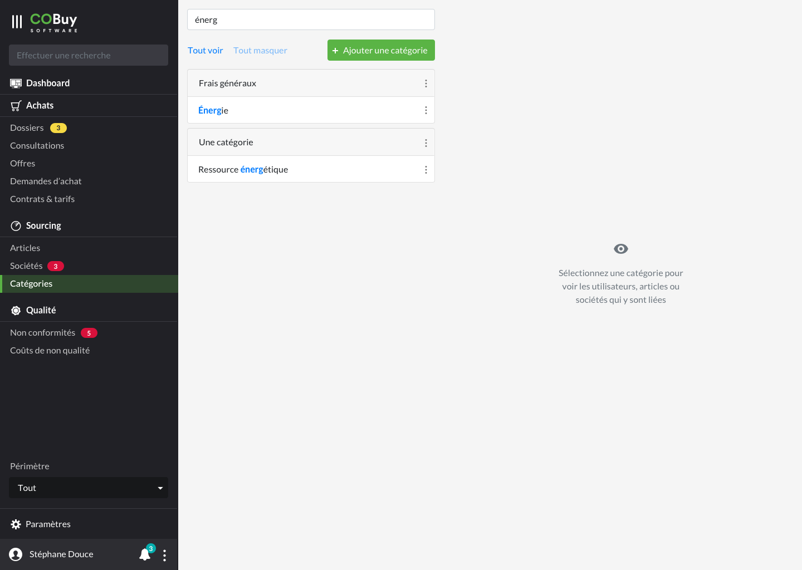

* table of contents
{:toc}

Focntionnement de la page catégories

## Liste éditable ##

L'affichage de la liste des catégories s'effectue grâce au composant [list group<i class="ico">external_link</i>](https://getbootstrap.com/docs/4.5/components/list-group/#links-and-buttons). Cette zone est affiché sur une largeur de 7 colonnes.

Le fond de la catégorie de premier niveau (l'en-tête de toute la catégorie, en somme) prendra un fond `--light`

  <a href="#" class="list-group-item list-group-item-action" style="background-color:#F8F9FA;">
    

      Tuyauterie<i class="ico ico-small">dots_v</i>
    

  </a>
  <a href="#" class="list-group-item list-group-item-action">
    

      Fluide<i class="ico ico-small">dots_v</i>
    

  </a>
  <a href="#" class="list-group-item list-group-item-action text-muted">
    

      Souple<i class="ico ico-small">dots_v</i>
    

  </a>
  <a href="#" class="list-group-item list-group-item-action active">
    

      Rigide<i class="ico ico-small">dots_v</i>
    

  </a>
  <a href="#" class="list-group-item list-group-item-action">
    

      Gaz<i class="ico ico-small">dots_v</i>
    

  </a>
  <a href="#" class="list-group-item list-group-item-action text-muted">
    

      Rigide<i class="ico ico-small">dots_v</i>
    

  </a>

 
Chaque ligne propose un menu contextuel (icone `dots_v`) permettant d'accéder à des fonctionnalités d'édition

  <a class="dropdown-item" href="#">Modifier</a>
  <a class="dropdown-item" href="#">Supprimer</a>

Le clic sur une ligne de catégorie affiche toutes les occurences d'objets liées à cette sous-catégorie.

#### Recherche contextuelle ####
La recherche contextuelle fonctionne sur le modèle défini dans les spécifications du [gabarit d'écran de liste](gabarits.listes.html#zone-de-recherchefiltrage-et-actions-principales). On ne propose pas de filtre pour cette recherche.

Dès qu'un utilisateur entre une lettre dans le champ de recherche, la liste éditable est filtrée pour n'afficher que les éléments correpondants à la recherche. On met en valeur avec `<strong>` et une couleur `--primary`, dans chaque catégorie remontée, l'élément qui correspond à la recherche de l'utilisateur. 

**Lorsqu'une sous-catégorie est remontée par la recherche, on laisse systématiquement affichée ses catégories parents**

#### Ajout d'une catégorie ####
Un bouton de couleur `--primary`, avec une icone `plus` aligné à gauche, permet d'ajouter une catégorie de premier niveau à la liste éditable. [Une modale](comp.modales.html) est affichée et permet d'entrer le nom de la nouvelle catégorie de premier niveau.

#### Ajout d'une sous-catégorie ####
Pour ajouter des catégories de sous-niveau, on passe au rollover sur la catégorie parent de l'élément que l'on veut créer. Un lien de couleur `--primary` est visible ; le clic affiche [une modale](comp.modales.html) qui permet d'entrer le nom de la nouvelle catégorie de sous-niveau.

#### Contrôle de l'affichage ####
Au dessus de la liste se trouvent deux liens, qui permettent de dérouler toute la structure de catégories et d'afficher l'arbre sur toute sa profondeur, ou bien de n'afficher que les catégories de premier niveau.

## Zone de contenu ##

Sur une largeur de 9 colonnes, on affiche la zone de contenu contrôlée par la liste éditable.

Par défaut, cette zone est vide : l'utilisateur doit choisir une catégorie ou une sous-caétgorie pour voir s'afficher les éléments correspondants. On y affiche, centré horizontalement et verticalement :
- une icone `eye`
- une phrase indiquant l'action à effectuer pour aller plus loin `
`

Au clic sur une sous-catégorie, on affiche les éléments suivants :
- Le chemin de la sous-catégorie `
`
- Le titre de celle-ci `<h3>`
- [Des onglets<i class="ico">external_link</i>](https://getbootstrap.com/docs/4.5/components/navs/#tabs) qui contrôlent l'affichage des éléments suivants, apparaissant sous forme de tableau.
  - Utilisateurs
  - Sociétés
  - Articles
  
Au début de chaque ligne de ces tableaux, une case à cocher est affichée, qui permet de traiter en masse des lignes de ce tableau, et de leur appliquer certaines actions (voir ci-dessous).

#### Actions ####
Un menu est proposé en haut à droite (icone `dots_v`) permettant d'avoir accès à des options pour la catégorie affichée

  <h6 class="dropdown-header" style="margin-top:0;">Catégorie</h6>
  <a class="dropdown-item" href="#">Modifier</a>
  <a class="dropdown-item disabled" href="#">Supprimer</a>
  

  <h6 class="dropdown-header" style="margin-top:0;">Ajouter un élément</h6>
  <a class="dropdown-item" href="#">Utilisateur</a>
  <a class="dropdown-item" href="#">Société</a>
  <a class="dropdown-item" href="#">Article</a>
      

	<a class="dropdown-item" href="#">Tout sélectionner</a>
	      

	<a class="dropdown-item disabled" href="#">Délier les éléments sélectionnés</a>

###### Catégorie ######
On peut modifier le nom d'une catégorie. En revanche, il faudra retirer tous les éléments de la catégorie pour pouvoir la supprimer.

###### Ajouter un élément ######
Cette partie permet de lier un élément existant du système (utilisateur, société ou article) à la catégorie active

###### Tout sélectionner ######
Cette option se transforme en *Tout désélectionner* dès qu'un élément de la liste active est coché.

###### Délier les éléments sélectionnés ######
Cette option permet de délier les éléments sélectionnés. Il faut au préalable cocher un ou plusieurs éléments de la liste.

En plus des possibilités d'édition en masse, chaque ligne de tableau affiche un menu (icone `dots_v`) qui offre la possibilité d'être délié de la catégorie active.

	<a class="dropdown-item" href="#">Délier l'élément</a>

