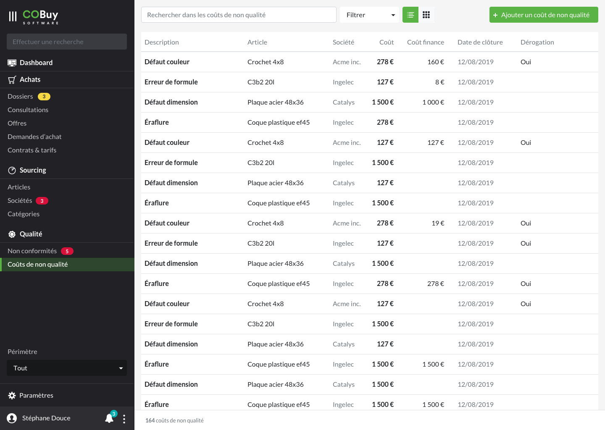

* table of contents
{:toc}

## Liste ##

Au clic sur la section dans la navigation principale, on affiche la liste des offres en cours.

Cet écran utilise les spécifications du [gabarit d'écran de liste](gabarits.listes.html)

Chaque ligne du tableau remonte, par défaut, ces informations
- La description `
<strong/>`
- L'article `
`
- La société `
`
- Le coût `
<strong/>`
- Le coût finance `
`
- La date de clôture `
`
- La dérogation `
`, *Oui* s'il y en a une

> Comme stipulé dans la [section Listes](gabarits.listes.html), il n'est pas nécessaire de nommer chaque colonne.

#### Recherche contextuelle ####
La recherche contextuelle fonctionne sur le modèle défini dans les spécifications du [gabarit d'écran de liste](gabarits.listes.html#zone-de-recherchefiltrage-et-actions-principales)

Le menu déroulant du filtre pourra être composé des options suivantes (ces options pourront être revues ou affinées en fonction des besoins):

  <h6 class="dropdown-header" style="margin-top:0;">Date de clôture</h6>
    <a class="dropdown-item" href="#">Dans moins de 3 jours</a>
  <a class="dropdown-item" href="#">Dans moins d'une semaine</a>
    <a class="dropdown-item" href="#">Dans moins d'un mois</a>
  

  <a class="dropdown-item" href="#">Dérogation</a>

## Détail ##

#### En-tête ####

Dans la zone de l'offre, l'information du **coût** de la non qualité est mise en avant.

#### Onglets ####

###### Non conformité ######

Reprise de liste (Voir [listes](gabarits.listes.html) et [Non-conformité](ui.non-conformite.html)).

###### Documents ######

Voir Documents dans [Documents, messages, notes](comp.docs-messages-notes.html)
