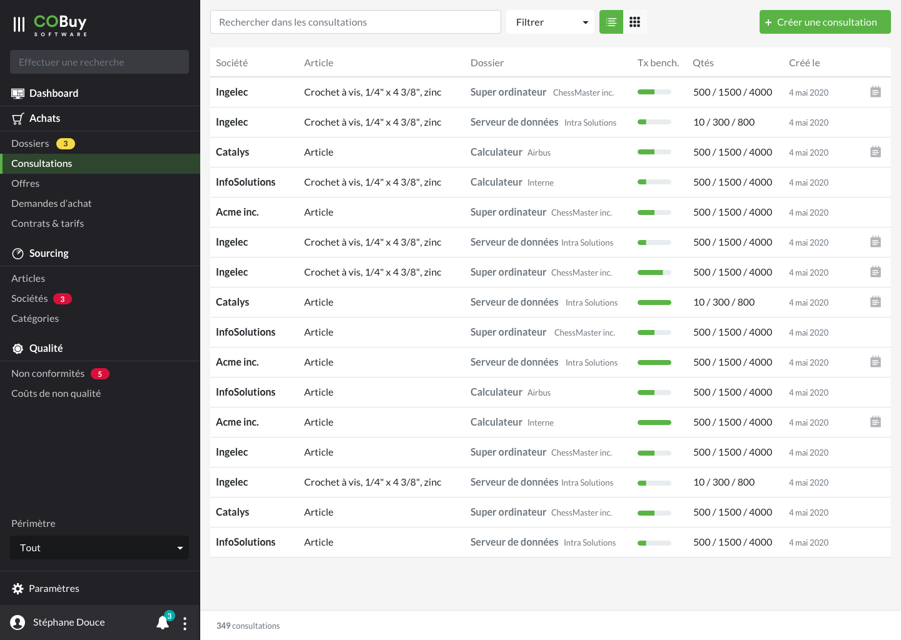
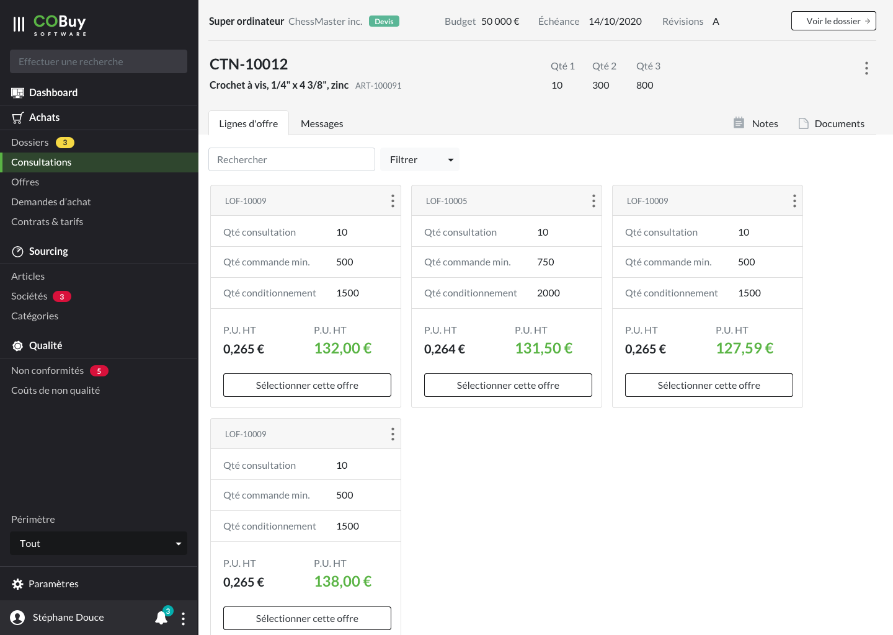

* table of contents
{:toc}

## Liste ##

Au clic sur la section dans la navigation principale, on affiche la liste des offres en cours.

Cet écran utilise les spécifications du [gabarit d'écran de liste](gabarits.listes.html).

Chaque ligne du tableau remonte, par défaut, ces informations
- La société `
<strong/>`
- L'article `
`
- Le dossier affilié `
<strong/>` et `
`
- le taux de benchmark. Le composant [progress<i class="ico">external_link</i>](https://getbootstrap.com/docs/4.5/components/progress/) est utilisé pour ce faire. Il remonte la proportion d'offres reçues en regard des demandes effectuées
- Les quantités `
`
- La date de création `
`
- L'icône `notes` si la consultation contient une note

> Comme stipulé dans la [section Listes](gabarits.listes.html), il n'est pas nécessaire de nommer chaque colonne.

#### Recherche contextuelle ####
La recherche contextuelle fonctionne sur le modèle défini dans les spécifications du [gabarit d'écran de liste](gabarits.listes.html#zone-de-recherchefiltrage-et-actions-principales)

Le menu déroulant du filtre pourra être composé des options suivantes (ces options pourront être revus ou affinés en fonction des besoins):

  <h6 class="dropdown-header" style="margin-top:0;">Taux de benchmark</h6>
  <a class="dropdown-item" href="#">Entre 0 et 15%</a>
  <a class="dropdown-item" href="#">Entre 15 et 50%</a>
  <a class="dropdown-item" href="#">Entre 50 et 75%</a>
    <a class="dropdown-item" href="#">Supérieur à 75%</a>
  

  <a class="dropdown-item" href="#">Contient une note</a>

## Détail ##

#### En-tête ####

Un rappel du dossier parent est affiché en haut de l'en-tête.

> Plus de détails dans les [spécifications de l'en-tête](gabarits.details#informations-dun-élément-parent)

#### Onglets ####

###### Lignes d'offres ######

Reprise de liste (Voir [listes](gabarits.listes.html)). Affichage des lignes liées à l'occurrence de consultations, sous forme de cartes (voir [cartes](comp.cartes-offres.html))

###### Messages ######

Voir Messages dans [Documents, messages, notes](comp.docs-messages-notes.html)

###### Notes ######

Voir Notes dans [Documents, messages, notes](comp.docs-messages-notes.html)

###### Documents ######

Voir Documents dans [Documents, messages, notes](comp.docs-messages-notes.html)
