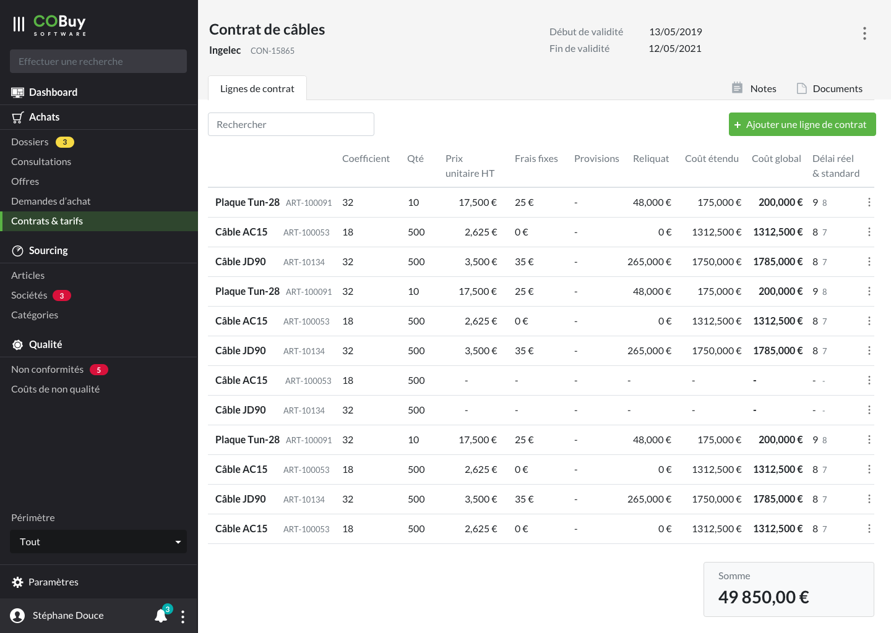

* table of contents
{:toc}

## Liste ##

Au clic sur la section dans la navigation principale, on affiche la liste des offres en cours.

Cet écran utilise les spécifications du [gabarit d'écran de liste](gabarits.listes.html)

Chaque ligne du tableau remonte, par défaut, ces informations
- Le nom de la société `
<strong/>`
- La description du contrat `
`
- Le montant du contrat `
`
- La fin de validité du contrat `
`

> Comme stipulé dans la [section Listes](gabarits.listes.html), il n'est pas nécessaire de nommer chaque colonne.

#### Recherche contextuelle ####
La recherche contextuelle fonctionne sur le modèle défini dans les spécifications du [gabarit d'écran de liste](gabarits.listes.html#zone-de-recherchefiltrage-et-actions-principales)

Le menu déroulant du filtre pourra être composé des options suivantes (ces options pourront être revus ou affinés en fonction des besoins):

  <h6 class="dropdown-header" style="margin-top:0;">Fin de validité</h6>
    <a class="dropdown-item" href="#">Moins de 1 semaine</a>
  <a class="dropdown-item" href="#">Moins de 2 semaines</a>
    <a class="dropdown-item" href="#">Moins d'un mois</a>
	    <a class="dropdown-item" href="#">Moins de trois mois</a>

## Détail ##

#### En-tête ####

> Plus de détails dans les [spécifications de l'en-tête](gabarits.details#en-tête.html)

#### Onglets ####

###### Lignes de contrats ######

Les lignes de contrats sont affichées sous forme de [tableau](comp.tableaux.html) utilisant le gabarit de [liste](gabarits.listes.html). Le tableau affiche :
- Nom `
<strong/>`
- Id de l'article `
`
- Quantité, prix unitaire HT, frais fixes, Provisions, reliquat, coût étendu `
`. Cette liste pourra être étendue selon les besoins
- Le coût global `
<strong/>`
- Le délai réel et le délai standard, dans la même cellule. Le délai réel est affiché grâce à `
`, le délai standard avec `
`

Un bouton avec icone `dots_v` permet, en bout de chaque ligne, de modifier ou de supprimer une ligne de contrat, ainsi que d'avoir accès à l'article de la ligne de contrat (dans [articles](ui.articles.html))

La somme est affichée sous forme de [carte](https://getbootstrap.com/docs/4.5/components/card/) de fond `--light`. Cet élément est **fixe au bas du viewport** :
- Libellé `
`
- Somme `<h3>`

###### Notes ######

Voir Notes dans [Documents, messages, notes](comp.docs-messages-notes.html)

###### Documents ######

Voir Documents dans [Documents, messages, notes](comp.docs-messages-notes.html)

