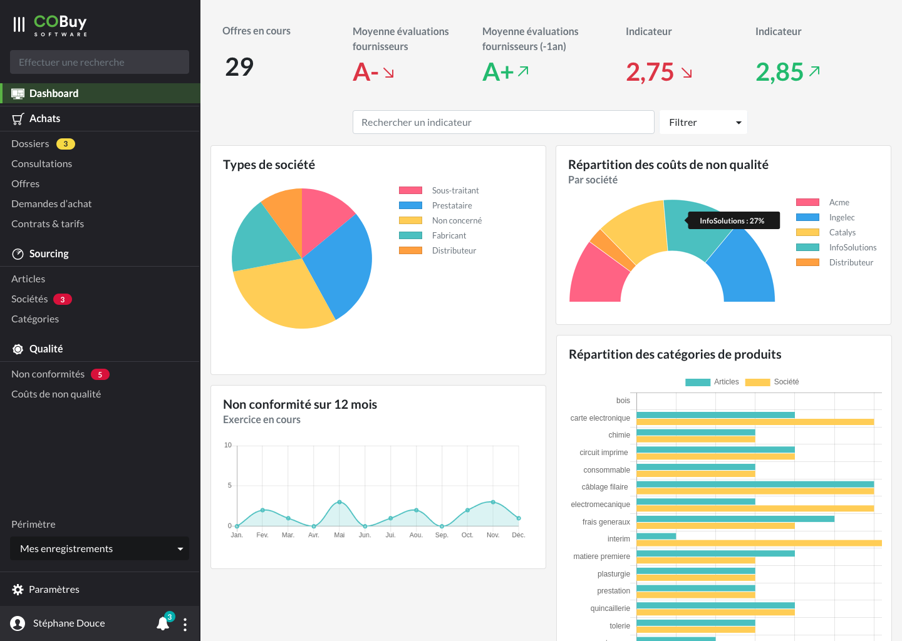

* table of contents
{:toc}

Immédiatement après la connexion, l'utilisateur est accueilli sur cet écran. Son but est de présenter des données récapitulatives, sous forme de _Key Performance Indicators_ (KPI) ou sous forme de [graphiques](ui.graphiques.html).

Cet écran permet également de présenter [la navigation principale de l'application](ux.navigation.html#navigation-principale-sidebar)

## Indicateurs (KPI) ##

Chaque KPI est défini sur 4 colonnes. Il comprend :
- un libellé `
`
- un indicateur chiffré ou textuel. `<h3>` S'il y a une tendance sur l'indicateur (progression ou régression par rapport à l'état précédent), on colorera l'indicateur avec les couleurs `--success` (progression) ou `--danger` (régression)
- si l'indicateur propose une tendance, on accompagne l'information d'une icone : `arrow_right_up` pour une progression, `arrow_right_down` pour une régression)

## Recherche & filtres ##

Une [zone de recherche avec filtre](ux.recherche.html#recherche-contextuelle) permet de retrouver un indicateur en particulier, ou de filtrer les graphiques par catégories (celles-ci correspondent à l'arbre de navigation principale).

## Indicateurs graphiques ##

Chaque graphique est présenté dans [une carte avec titre et sous-titre<i class="ico">external_link</i>](https://getbootstrap.com/docs/4.5/components/card/#titles-text-and-links). Il doit pouvoir y avoir deux graphiques sur la largeur de la zone principale. Une carte est définie sur une largeur de 8 colonnes. 

Le graphique est généré avec ChartJS (voir [graphiques](comp.graphiques.html)), en utilisant les couleurs supplémentaires définies dans la partie [couleurs](comp.couleurs.html)

