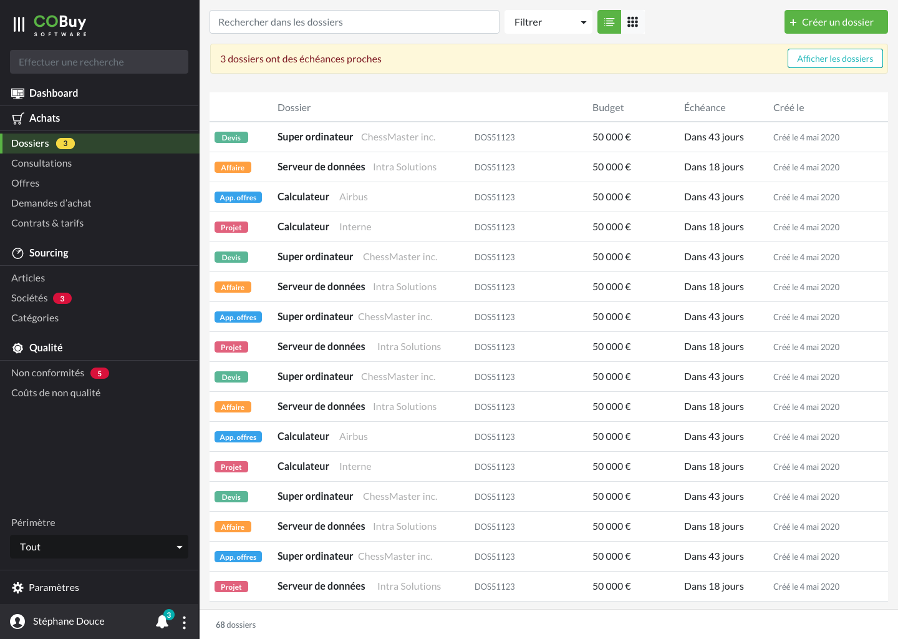
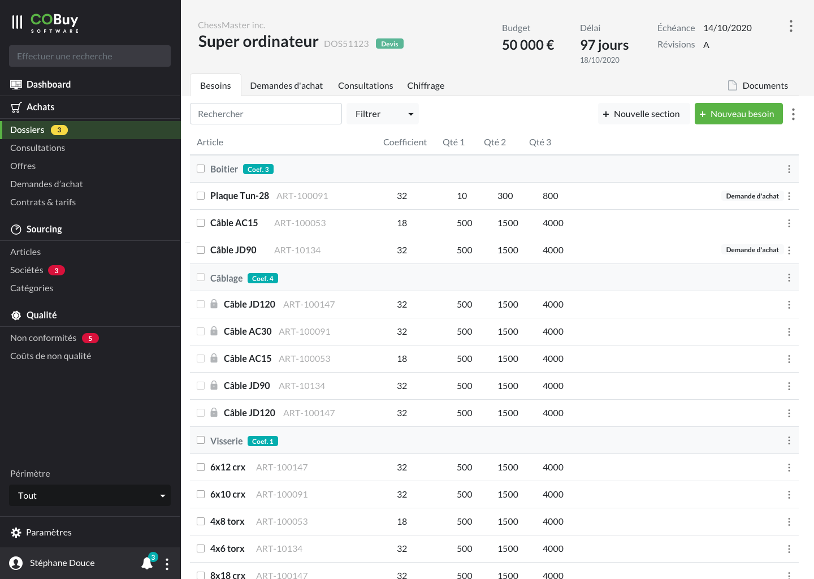
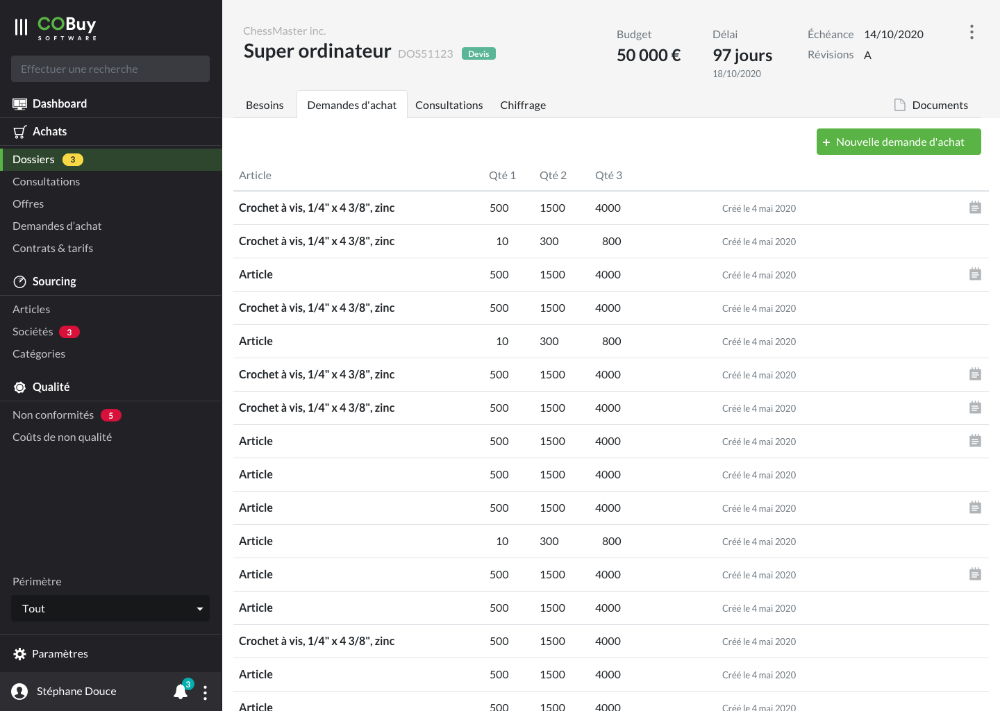

* table of contents
{:toc}

Le dossier est un élément central du système. Il embarque des fonctionnalités avancées de consultation et de chiffrage, et à partir de lui rayonne une grande quantité des informations présentes dans le système.

## Liste ##

Au clic sur la section dans la navigation principale, on affiche la liste des dossiers en cours.

Cet écran utilise les spécifications du [gabarit d'écran de liste](gabarits.listes.html)

Chaque ligne du tableau remonte, par défaut, ces informations
- un badge affichant le type du dossier (affaire, appel d'offres, devis ou projet) (badge). Chaque caractéristique prendra une des [couleurs personnalisés](ui.couleurs.html#couleurs-de-base)
- le titre du dossier, accompagné du client `
<strong/>`
- la référence du dossier `
`
- le budget `
`
- l'échéance `
`
- la date de création `
`

Un badge doté d'un fond `--warning` et contenant un `!` sera affiché sur les dossiers présentant un retard qui doit être remonté à l'utilisateur.

> Comme stipulé dans la [section Listes](gabarits.listes.html), il n'est pas nécessaire de nommer chaque colonne.

#### Recherche contextuelle ####
La recherche contextuelle fonctionne sur le modèle défini dans les spécifications du [gabarit d'écran de liste](gabarits.listes.html#zone-de-recherchefiltrage-et-actions-principales)

Le menu déroulant du filtre pourra être composé des options suivantes (ces options pourront être revus ou affinés en fonction des besoins):

  <a class="dropdown-item" href="#">Affaire</a>
  <a class="dropdown-item" href="#">Appel d'offres</a>
  <a class="dropdown-item" href="#">Devis</a>
  <a class="dropdown-item" href="#">Projet</a>
  

  <a class="dropdown-item" href="#">Dossiers en retard</a>
    

  <a class="dropdown-item" href="#">Mes dossiers</a>

## Détail ##

#### En-tête ####

En plus du nom du dossier, les informations de **budget** et de **délai** sont mises en avant.

> Plus de détails dans les [spécifications de l'en-tête](gabarits.details#en-tête.html)

#### Paramètres du dossier ####

[ capture paramètres ]

#### Demandes d'achat et consultations ####

On retrouve dans ces deux sous-sections
- une recherche contextuelle à la sous-section, accompagnée de son filtre
- un bouton de création de contenu

Immédiatement en dessous, [on retrouve une liste](gabarits.listes.html) de demandes d'achat ou de consultations. Cette vue liste ne propose pas de choix entre une vue *tableau* et une vue *grille*, contrairement à une liste principale (accueil de section). Ces vues sont des reprises de liste de [demandes d'achat](ui.demandes-achat.html) ou de [consultations](ui.consultations.html). 

**On veillera à retirer, dans ce contexte, les informations qui ne sont pas nécessaires** (identité du client ou nom du dossier, déjà présent dans l'en-tête de la page). 

**Le clic sur une des lignes de tableaux renvoie vers l'objet correspondant, dans son contexte d'origine** (si c'est une demande d'achat, l'utilisateur est renvoyé vers la page *détail* de la demande d'achat en question).

#### Besoins ####
La vue qui permet de gérer les besoins du dossier est construite sur une [base de gabarit liste avec vue tableau](gabarits.listes.html#vue-tableau).

Elle possède donc un champ de recherche avec filtre, qui permet de rechercher dans la liste des besoins. **Si un besoin correspond à la recherche** de l'utilisateur, on garde sa section affichée (la ligne de besoin correpondante apparait donc sous sa section). **Si une section correspond à la recherche** de l'utilisateur, on affiche la section remontée et tous ses besoins associés, sous celle-ci.

Alignés à droite, on trouve deux boutons d'ajout de contenu
- Ajouter une section `<button class="btn btn-light">`
- Ajouter un besoin `<button class="btn btn-primary">`. Ce bouton est mis en valeur

Enfin, à la toute droite de cette zone, on place un menu d'options accessible via une icone `dots_v`. Ce menu embarque les options suivantes :

  <a class="dropdown-item" href="#">Tout sélectionner</a>
  

  <a class="dropdown-item disabled" href="#">Lancer des consultations</a>
  <a class="dropdown-item disabled" href="#">Lancer des demandes d'achat</a>

Le deux options de lancement sont inactives par défaut, car il faut cocher une ligne du tableau de besoins pour pouvoir y accéder. 

L'option *Tout sélectionner* fonctionne avec les checkboxes des lignes de tableaux. Un clic sur cette option coche toutes les lignes accessibles par l'utilisateur (toutes celles qui ne comportent pas de cadenas, qui sont celles qui ne lui appartiennent pas).

Dès qu'une case est cochée dans le tableau, l'option *Tout sélectionner* se transforme en *Tout déselectionner*

  <a class="dropdown-item" href="#">Tout désélectionner</a>
  

  <a class="dropdown-item" href="#">Lancer des consultations</a>
  <a class="dropdown-item" href="#">Lancer des demandes d'achat</a>

Dès qu'une demande d'achat est effectuée, la ou les lignes de tableau concernées affichent un badge *Demande d'achat* sur leru droite

Ensuite, on retrouve une vue tableau possédant quelques fonctionnalités supplémentaires

##### Lignes de sections #####
[capture]

Chaque ligne de section est matérialisée par un fond `--light`. Elle affiche :
- une checkbox, qui permet de sélectionner tous les éléments de la section
- un nom `
<strong/>`
- un coefficient dans un badge de couleur `--info`

Chaque ligne possède un menu d'options, aligné à droite (icone `dots_v`), qui affiche, par défaut :

  <a class="dropdown-item" href="#">Lancer les consultations</a>
  <a class="dropdown-item" href="#">Lancer les demandes d'achat</a>
  

  <a class="dropdown-item" href="#">Tout sélectionner</a>
  <a class="dropdown-item" href="#">Modifier</a>
  <a class="dropdown-item" href="#">Supprimer</a>

##### Lignes de tableaux #####
[capture]

Chaque ligne de [tableau](comp.tableaux.html) affiche :
- une checkbox, qui permet de sélectionner l'élément, pour pouvoir ensuite l'intégrer dans un lancement global de consultations ou de demandes d'achat. si le besoin n'est pas accessible à l'utilisateur, cette checkbox reste affichée, mais est désactivée
- une icone `lock` si le besoin n'est pas acessible à l'utilisateur
- un nom `
<strong/>`
- un identifiant `
`
- un coefficient `
`
- 1 à n lignes de quantité `
`

Si une consultation ou une demande d'achat est lancée sur cette ligne, on lui ajoute, aligné à droite, un badge *Demande d'achat* (couleur `--light`) ou une icone `megaphone_alt` symbolisant une consultation.

Chaque ligne possède un menu d'options, aligné à droite (icone `dots_v`), qui affiche, par défaut :

  <a class="dropdown-item" href="#">Lancer une consultation</a>
  <a class="dropdown-item" href="#">Lancer une demande d'achat</a>
  

  <a class="dropdown-item" href="#">Supprimer</a>

Si une demande d'achat et une consultation sont lancées sur cette ligne, le menu devient

  <a class="dropdown-item" href="#">Voir la consultation</a>
  <a class="dropdown-item" href="#">Voir la demande d'achat</a>
  

  <a class="dropdown-item" href="#">Supprimer</a>

#### Chiffrage ####

[ capture ]

La vue qui permet d'effectuer le chiffrage est construite sur une [base de gabarit liste avec vue tableau](gabarits.listes.html#vue-tableau)
Elle possède un champ de recherche avec filtre, permettant de rechercher dans la liste des lignes de chiffrage.

Ensuite, on affiche un [*button Group* <i class="ico">external_link</i>](https://getbootstrap.com/docs/4.5/components/button-group/#basic-example) qui permet de naviguer entre les chiffrages correspondant aux quantités définies dans les paramètres généraux du dossier. dans l'exemple, le dossier possède trois quantités : 1, 3 et 8.

Un menu d'options (icone `dots_v`) permet d'avoir accès à des fonctionnalités propres à cette partie, comme la sauvegarde d'un état du chiffrage e.g.

##### Ligne de chiffrage #####

[ ligne chiffrage ]

Ensuite, on retrouve une vue tableau possédant quelques fonctionnalités supplémentaires

Chaque ligne de tableau remonte les éléments suivants :
- si l'article/besoin n'est pas accessible à l'utilisateur, on affiche une icone `lock`
- Nom `
<strong/>`
- Id de l'article `
`
- Coefficient, quantité, prix unitaire HT, frais fixes, Provisions, reliquat, coût étendu `
`. Cette liste pourra être étendue selon les besoins
- Le coût global `
<strong/>`
- Le délai réel et le délai standard, dans la même cellule. Le délai réel est affiché grâce à `
`, le délai standard avec `
`

Chaque ligne possède un menu d'options, aligné à droite (icone `dots_v`), qui affiche, par défaut :

  <h6 class="dropdown-header" style="margin-top:0;">Critères de chiffrage</h6>
  <a class="dropdown-item" href="#">Coût</a>
  <a class="dropdown-item" href="#">Coût global</a>
  <a class="dropdown-item" href="#">Délai</a>
  <a class="dropdown-item" href="#">Coût global dans le délai</a>
  

  <a class="dropdown-item" href="#">Consulter l'offre</a>

Les 4 premières options recoupent avec les critères du chiffrage global (voir ci-dessous, *Résultat - total*). On peut *overrider* le critère de chiffrage global en sélectionnant pour une ligne un critère de chiffrage particulier. Le fond de la ligne de chiffrage sera alors coloré avec un jaune `#FDFCF2`.

L'option de consultation d'offre renvoie vers une page de détail de l'offre correspondante, [dans son contexte originel](ui.offres.html) dans la section *Offres*

##### Résultat #####

[ capture ]

Au bas de ce tableau, on affiche une zone qui détaille le résultat du chiffrage. Celle-ci, comme [l'en-tête](comp.entetes.html), est fixe. Cela signifie que le défilement du tableau contenant les lignes de chiffrage laissera toujours visible ce composant au bas du *viewport*.

Cette zone est divisée en trois parties, qui sont chacunes affichées dans des [cartes simples <i class="ico">external_link</i>](https://getbootstrap.com/docs/4.5/components/card/#body)

###### Quantité totale ######
Sur un fond `--light`, on affiche la quantité totale d'articles. Chaque élément est composé des éléments suivants, distribués verticalement :
- un libellé `
`
- une valeur `
`

###### Sommes annexes ######
Sur un fond `--light`, on affiche la quantité totale d'articles. Chaque élément est composé des éléments suivants, distribués verticalement :
- un libellé `
`
- une valeur `
`

###### Total ######
Le total est l'élément qui embarque le plus de fonctionnalités. Il est matérialisé par un fond `--cobuy-7`, ce qui signifie que les couleurs des libellés et valeurs devront être inversés (couleur `--white`)
On y retrouve trois éléments principaux :
- le critère de chiffrage
- le coût global
- le délai global
- un lien vers une fenêtre de statistiques (désactivée tant qu'aucun chiffrage n'est effectué)

Le critère de chiffrage est un [dropdown <i class="ico">external_link</i>](https://getbootstrap.com/docs/4.5/components/dropdowns/) qui affiche les options suivantes :

  <a class="dropdown-item" href="#">Coût</a>
  <a class="dropdown-item" href="#">Coût global</a>
  <a class="dropdown-item" href="#">Délai</a>
  <a class="dropdown-item" href="#">Coût global dans le délai</a>

Un clic sur une des options sélectionne dans chacune des offres de chaque ligne du chiffrage celle qui correspond le mieux à ce choix. Devant le choix sélectionné, on affiche une icone `check` de couleur `--success`.

Après ce choix, les valeurs de coût global et de délai peuvent être affichées de la façon suivante
- libellé `
`, couleur `--white`
- valeur `<h3>`, couleur `--white`

L'icone `graph` qui se situe à l'extrême droite de la carte est également alors activée (`opacity: 0.5;` vers `opacity: 1;` e.g.). Un clic sur celle-ci affiche une fenêtre modale qui remonte des statistiques pertinentes sur l'état actuel du chiffrage (voir ci-dessous).

Si l'opération de chiffrage remonte des anomalies qui corrompent le coût global, les valeurs de coût global et de délai sont colorées avec `--warning`. On affiche également, coloré avec `--warning`, une icone `caution` à droite de la valeur de coût global. Un survol de cette icone affiche un [tooltip <i class="ico">external_link</i>](https://getbootstrap.com/docs/4.5/components/tooltips/) qui explique la cause principale de cette anomalie.

Si ce critère de chiffrage se voit *overridé* par un critère spécifique, choisi par l'utilisateur pour une ligne de chiffrage (voir ci-dessus *Ligne de chiffrage*), on affiche alors un badge de couleur `--warning` à côté du libellé du critère de chiffrage, et affichant *Spécifique*. La conjonction de cet élément, avec la couleur de la ligne qui bénéficie d'un critère spécifique, rend visible l'état actuel du chiffrage. 

#### Statistiques ####

[ capture ]

Après le lancement d'un chiffrage, des statistiques pertinentes permettent à l'utilisateur de prendre des décisions quant au choix des offres. Ces statistiques prennent la forme de [graphiques](ui.graphiques.html), qui sont chacun affichés dans des [cartes avec titres et sous-titres <i class="ico">external_link</i>](https://getbootstrap.com/docs/4.5/components/card/#titles-text-and-links). Ces graphiques sont actualisés à chaque changement dans le chiffrage.

#### Éléments ####
