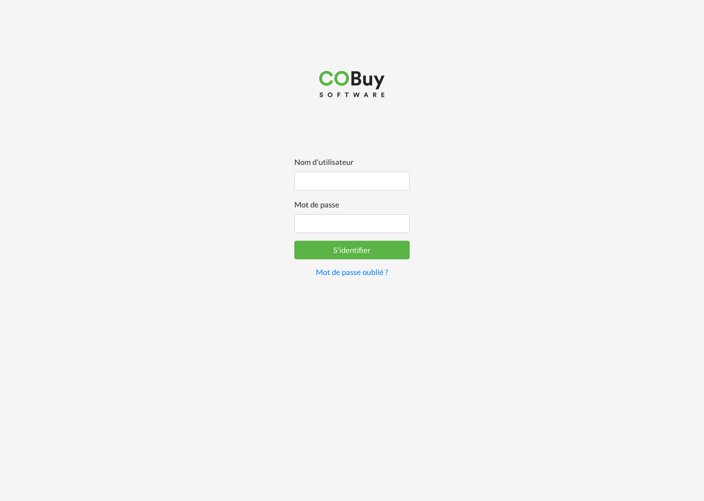

* table of contents
{:toc}

L'écran de login est présenté à l'utilisateur si sa session est inexistante ou expirée. Cet écran est composé de deux groupes :
- b en version *dark* (voir les [fichiers](ressources.fichiers.html))
- **le formulaire de connexion** composé de deux champs *Nom d'utilisateur* et *mot de passe*, un bouton avec un label *S'identifier* (couleur `--primary`), et un lien simple qui conduit vers une procédure de réinitialisation du mot de passe (libellé *Mot de passe oublié ?*).

Le groupe formulaire est centrée verticalement dans l'écran. Le logo est centré verticalement entre le haut du viewport et le formulaire.

Le fond de l'écran est de couleur `--light`.

