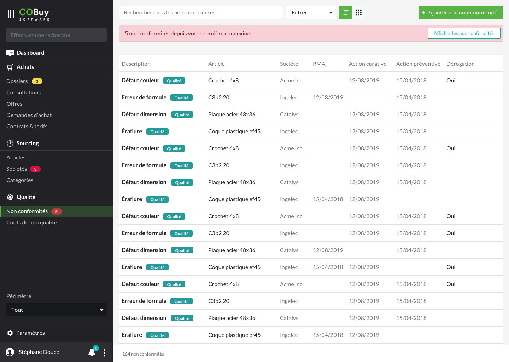

* table of contents
{:toc}

## Liste ##

Au clic sur la section dans la navigation principale, on affiche la liste des offres en cours.

Cet écran utilise les spécifications du [gabarit d'écran de liste](gabarits.listes.html)

Chaque ligne du tableau remonte, par défaut, ces informations
- La description `
<strong/>`, accompagnée d'un badge affichant le type de la non-conformité (qualité, logistique). Chaque type prendra une des couleurs personnalisés
- La société concernée `
`
- L'article concerné `
`
- La date de RMA `
`
- La date d'action curative`
`
- La date d'action préventive `
`
- La dérogation `
`

> Comme stipulé dans la [section Listes](gabarits.listes.html), il n'est pas nécessaire de nommer chaque colonne.

#### Recherche contextuelle ####
La recherche contextuelle fonctionne sur le modèle défini dans les spécifications du [gabarit d'écran de liste](gabarits.listes.html#zone-de-recherchefiltrage-et-actions-principales)

Le menu déroulant du filtre pourra être composé des options suivantes (ces options pourront être revues ou affinées en fonction des besoins):

  <a class="dropdown-item" href="#">Qualité</a>
  <a class="dropdown-item" href="#">Logistique</a>
  

  <a class="dropdown-item" href="#">Retail Material Agreement renseigné</a>
    <a class="dropdown-item" href="#">Action curative renseignée</a>
	  <a class="dropdown-item" href="#">Action préventive renseignée</a>
    

  <a class="dropdown-item" href="#">Dérogation</a>
  

  <a class="dropdown-item" href="#">Voir les non-conformités fermées</a>

À noter qu'en sélectionnant *Voir les non conformités fermées*, on appelle des résultats absents de la liste par défaut, les non conformités fermées n'étant par défaut pas disponibles.

## Détail ##

#### En-tête ####

Dans la zone de l'offre, les informations de **budget** et de **délai** sont mises en avant.

> Plus de détails dans les [spécifications de l'en-tête](gabarits.details.html#en-tête)

#### Onglets ####

###### Coûts de non qualité ######

Reprise de liste, vue [tableau](comp.tableaux.html) affichant les [coûts de non qualité](ui.cnq.html) liés à l'occurence de non-conformité.

###### Notes ######

Voir Notes dans [Documents, messages, notes](comp.docs-messages-notes.html)

###### Documents ######

Voir Documents dans [Documents, messages, notes](comp.docs-messages-notes.html)
