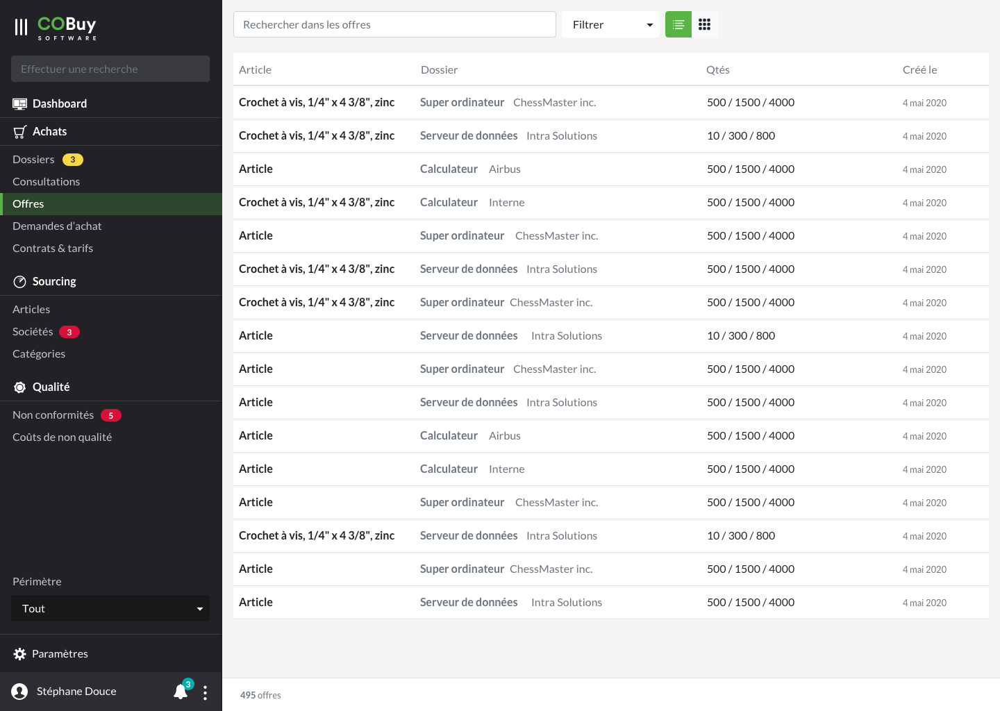
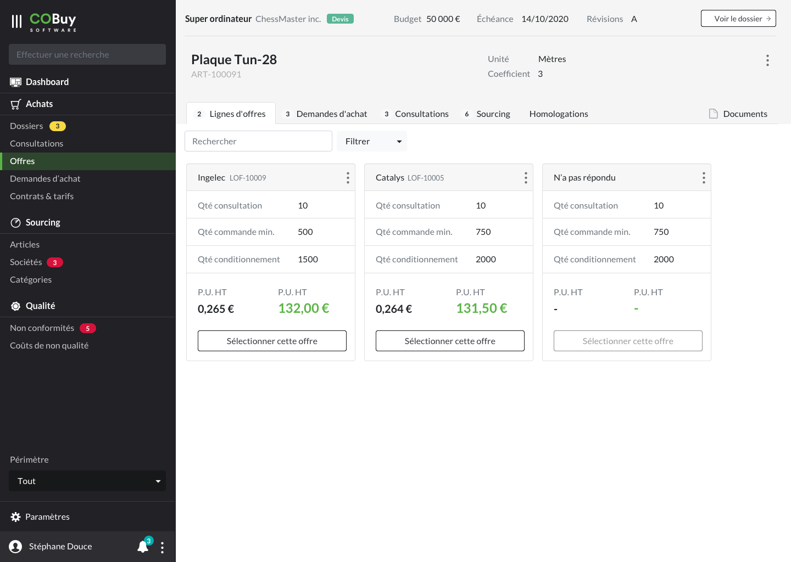

* table of contents
{:toc}

## Liste ##

Au clic sur la section dans la navigation principale, on affiche la liste des offres en cours.

Cet écran utilise les spécifications du [gabarit d'écran de liste](gabarits.listes.html)

Chaque ligne du tableau remonte, par défaut, ces informations
- Le nom de l'article `
<strong/>`
- Le dossier affilié `
<strong/>` et `
`
- Les quantités de l'offre `
`
- La date de création de l'offre `
`

> Comme stipulé dans la [section Listes](gabarits.listes.html), il n'est pas nécessaire de nommer chaque colonne.

#### Recherche contextuelle ####
La recherche contextuelle fonctionne sur le modèle défini dans les spécifications du [gabarit d'écran de liste](gabarits.listes.html#zone-de-recherchefiltrage-et-actions-principales)

## Détail ##

#### En-tête ####

Un rappel du dossier parent est affiché en haut de l'en-tête.

Dans la zone de l'offre, les informations de **budget** et de **délai** sont mises en avant.

> Plus de détails dans les [spécifications de l'en-tête](gabarits.details#en-tête.html)

#### Onglets ####

###### Lignes d'offres ######

Reprise de liste (Voir [listes](gabarits.listes.html)). Affichage des lignes liées à l'occurence d'offre, sous forme de cartes (voir [cartes](comp.cartes-offres.html))

###### Demandes d'achat ######

Reprise de liste, vue [tableau](comp.tableaux.html) affichant les [demandes d'achat](ui.demandes-achat.html) liés à l'occurence d'offre.

###### Consultations ######

Reprise de liste, vue [tableau](comp.tableaux.html) affichant les [consultations](ui.consultations.html) liés à l'occurence d'offre.

###### Sourcing ######

Reprise de liste, vue [tableau](comp.tableaux.html) affichant les catégories liées à l'offre.

###### Homologations ######

Liste, vue [tableau](comp.tableaux.html) affichant les homologationsde  l'occurence d'offre.

###### Documents ######

Voir Documents dans [Documents, messages, notes](comp.docs-messages-notes.html)
