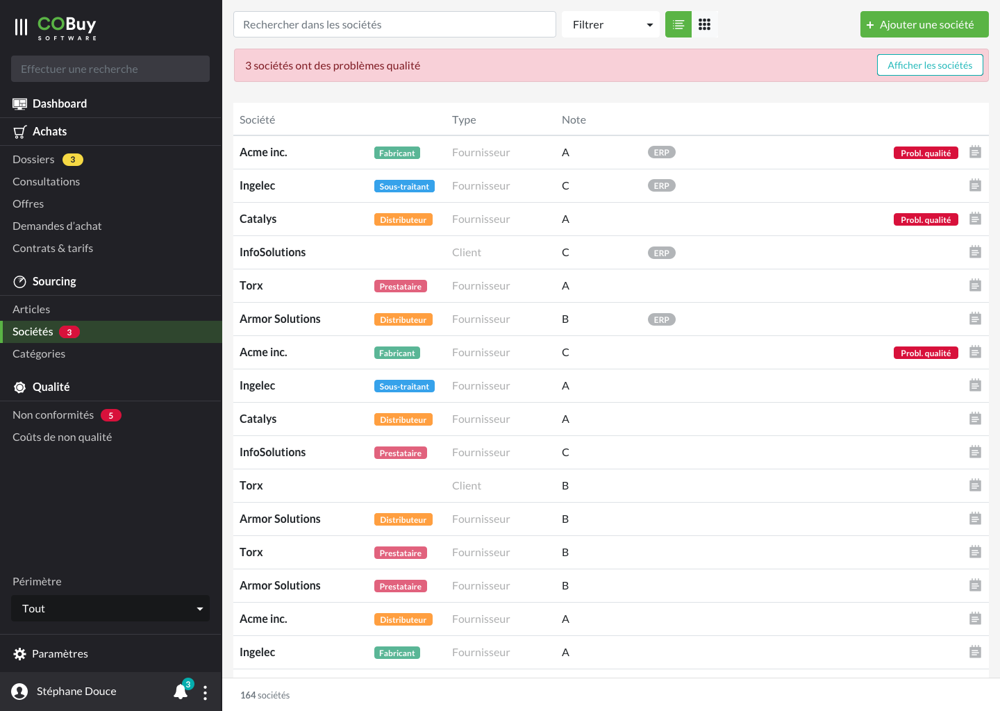
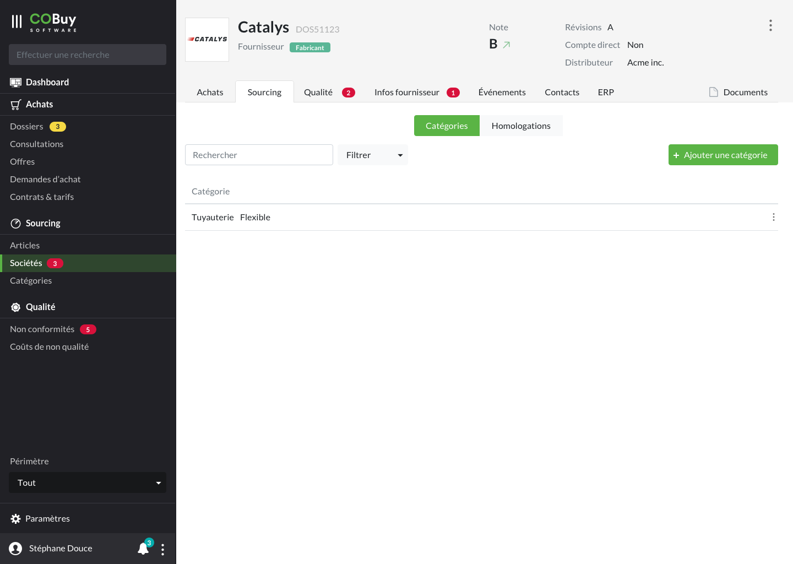

* table of contents
{:toc}

## Liste ##
Au clic sur la section dans la navigation principale, on affiche la liste des sociétés.

Cet écran utilise les spécifications du [gabarit d'écran de liste](gabarits.listes.html)

Chaque ligne du tableau remonte, par défaut, ces informations
- le nom de la société `
<strong/>`
- un [badge<i class="ico">external_link</i>](https://getbootstrap.com/docs/4.5/components/badge/#contextual-variations) affichant une caractéristique de société (fabricant, distributeur, sous-traitant). Chaque caractéristique prendra une des [couleurs personnalisées](ui.couleurs.html#couleurs-de-base)

- le type de société (client ou fournisseur) `
`
- la note `
`
- un [pill-badge<i class="ico">external_link</i>](https://getbootstrap.com/docs/4.5/components/badge/#pill-badges) avec un fond `--light-grey` indiquant si la donnée provient de l'ERP
- un [badge<i class="ico">external_link</i>](https://getbootstrap.com/docs/4.5/components/badge/#contextual-variations) avec un fond `--alert` remontant un problème de qualité sur cette société.
- une icone `notes` est affichée si l'occurence contient des notes

> Comme stipulé dans la [section Listes](gabarits.listes.html), il n'est pas nécessaire de nommer chaque colonne.

#### Recherche contextuelle ####
La recherche contextuelle fonctionne sur le modèle défini dans les spécifications du [gabarit d'écran de liste](gabarits.listes.html#zone-de-recherchefiltrage-et-actions-principales)

Le menu déroulant du filtre pourra être composé des options suivantes (ces options pourront être revus ou affinés en fonction des besoins):

  <a class="dropdown-item" href="#">Fournisseur</a>
  <a class="dropdown-item" href="#">Client</a>
  

  <a class="dropdown-item" href="#">Distributeur</a>
  <a class="dropdown-item" href="#">Fabricant</a>
  <a class="dropdown-item" href="#">Prestataire</a>
  <a class="dropdown-item" href="#">Sous-traitant</a>
  

  <h6 class="dropdown-header" style="margin-top:0;">Note</h6>
  <a class="dropdown-item" href="#">A</a>
  <a class="dropdown-item" href="#">B</a>
  <a class="dropdown-item" href="#">C</a>
  

  <a class="dropdown-item" href="#">Problème qualité</a>
  

  <a class="dropdown-item" href="#">Donnée ERP</a>

## Détail ##

#### En-tête ####

En plus du nom de la société, la **note** correspondant à l'évaluation de la société est mise en avant.

> Plus de détails dans les [spécifications de l'en-tête](comp.entetes.html)

#### Paramètres de la société ####

[ capture paramètres ]

#### Achats ####
Cette sous-section est divisée en deux parties :
- offres
- contrats & tarifs

On navigue entre ces deux sous-parties grâce à un [*button group* <i class="ico">external_link</i>](https://getbootstrap.com/docs/4.5/components/button-group/#basic-example)

On retrouve dans chacune de ces sous-parties
- une recherche contextuelle à la sous-partie, accompagnée de son filtre
- un bouton de création de contenu, si nécessaire

Immédiatement en dessous, [on retrouve un tableau](comp.tableaux.html) d'offres ou de contrats concernant la société active. 
> Cette vue liste ne propose pas de choix entre une vue *tableau* et une vue *grille*, contrairement à une liste principale (accueil de section).

Ces vues sont des reprises de liste [d'offres](ui.offres.html) ou de [contrats & tarifs](ui.contrats.html). **On veillera à retirer, dans ce contexte, les informations qui ne sont pas nécessaires** (identité de la société, déjà présent dans l'en-tête de la page).

Le clic sur une des lignes de tableaux renvoie vers l'objet correspondant, dans son contexte d'origine (si c'est une offre, l'utilisateur est renvoyé vers la page *détail* de l'offre en question).

#### Sourcing ####
Cette sous-section est divisée en deux parties :
- catégories
- homologations

On navigue entre ces deux sous-parties grâce à un [*button group* <i class="ico">external_link</i>](https://getbootstrap.com/docs/4.5/components/button-group/#basic-example)

On retrouve dans chacune de ces sous-parties
- une recherche contextuelle à la sous-partie, accompagnée de son filtre
- un bouton de création de contenu, si nécessaire

Immédiatement en dessous, [on retrouve un tableau](comp.tableaux.html) de catégories ou d'homologations concernant la société active. 
> Cette vue liste ne propose pas de choix entre une vue *tableau* et une vue *grille*, contrairement à une liste principale (accueil de section).

La vue *catégorie* liste toutes les catégories auxquelles la société est liée. Le bouton de création de contenu permet de lier la société à une nouvelle sous-catégorie. L'action d'ajouter une catégorie ouvrira une [fenêtre modale](comp.modales.html), qui contiendra un champ permettant de rechercher les catégories du système et de lier celles-ci à la société active.

La vue *homologation* est une reprise de la liste d'homologations.

#### Qualité ####
La sous-section *qualité* est divisée en deux parties :
- évaluation
- conformité documentaire

On navigue entre ces deux sous-parties grâce à un [*button group* <i class="ico">external_link</i>](https://getbootstrap.com/docs/4.5/components/button-group/#basic-example)
 

##### Évaluation #####
L'écran affiche, sous [forme de cartes](https://getbootstrap.com/docs/4.5/components/card/#titles-text-and-links), les données d'évaluation de la société, et des retours statistiques.

Sur les 8 premières colonnes, à gauche, on dispose l'une au dessus de l'autre les cartes *finances*, *qualité* et *logistique*. Le titre de la carte est le style proposé par le composant de base.
L'intérieur de la carte est composé d'une grille de 12 colonnes. Sur 4 colonnes, on met en place les indicateurs pour chaque carte :
- libellé `
`
- la valeur `<h3>`

Ensuite, on affiche le résumé que l'utilisateur aura pu entrer pour cette partie (avec `
`). Ce texte prendra la largeur complète de la carte.

Sur les 7 colonnes suivantes, à droite, on affiche une grande carte qui contient les statistiques les plus pertinentes. Quelques proopositions :
- Non conformité par type ([w/ composant *pie* <i class="ico">external_link</i>](https://www.chartjs.org/docs/latest/charts/doughnut.html))
- Évolution de la note sur 10 ans ([w/ composant *line* <i class="ico">external_link</i>](https://www.chartjs.org/docs/latest/charts/line.html))
- Non conformité par statut clos (w/ composant *pie*)

Une colonne est laissée, à droite, pour pouvoir positionner le menu d'options (icone `dots_v`). Ce menu permet d'avoir accès à des vues comme l'historique de l'évaluation de la société (en vue [modale](comp.modales.html)).

##### Conformité documentaire #####
Cette sous-partie est basé sur le [gabarit d'écran de liste](gabarits.listes.html). On y retrouve donc, en haut :
- une recherche contextuelle à la sous-section, accompagnée de son filtre
- un bouton de création d'un document de conformité

Immédiatement en dessous, [on retrouve un tableau](comp.tableaux.html) listant les conformités documentaires propres à cette société. 
> Cette vue liste ne propose pas de choix entre une vue *tableau* et une vue *grille*, contrairement à une liste principale (accueil de section).

Chaque cellule de tableaux est composée de ces éléments :
- Description du document `
<strong/>`
- Type de contrôle `
`
- Début de validité `
`
- Date de clôture `
`
  - si la date de clôture est dépassée, on affiche à côté de cette date un [pill-badge<i class="ico">external_link</i>](https://getbootstrap.com/docs/4.5/components/badge/#pill-badges) avec un fond `--warning` indiquant le mot *Retard*
- Une date de relance préventive `
`

On ajoute également deux éléments par rapport à une ligne de tableau par défaut :
- un bouton de téléchargement du document, avec l'icone `download_o` et un fond `--light`
- un menu d'accès (avec icone `dots_v`) aux options suivantes :

  <a class="dropdown-item" href="#">Mettre à jour</a>
  <a class="dropdown-item" href="#">Supprimer</a>

#### Informations fournisseur ####

[ capture ]

Les informations fournisseur sont en lecture seule, car elles sont éditées par la société sur le portail.

En préambule, on affiche, avec libellé `
` et valeur `
` sur la même ligne :
- la déclaration de certification
- la date de déclaration

On pourra ajouter ici toute autre information générale sur la déclaration qui n'entre pas dans les catégories *chiffre d'affaires* ou *effectif*

Ensuite, on retrouve dans des cartes établies sur 4 colonnes en largeur, les données déclarées par le fournisseur. Chaque carte contient ces éléments, affichés l'un au dessus de l'autre :
- le libellé `
`
- la valeur `<h3>`

Les cartes sont regroupées par catégorie. Ces catégories sont introduites par un titre `<h5>`

#### Événements, contacts ####
On retrouve dans ces sous-sections
- une recherche contextuelle à la sous-section, accompagnée de son filtre
- un bouton de création de contenu

Immédiatement en dessous, [on retrouve un tableau](comp.tableaux.html) d'événements ou de contacts. Cette vue liste ne propose pas de choix entre une vue *tableau* et une vue *grille*, contrairement à une liste principale (accueil de section).

> L'affichage de ces deux sous-sections reste à définir, n'ayant pas été traité en phase de conception.

#### ERP ####
Cette sous-section remonte des données provenant de l'ERP. L'affichage de cette sous-section reste à définir, car il n'a pas été traité en phase de conception.

#### Documents ####
> Voir [le gabarit pour documents](gabarits.docs.messages.notes.md)

