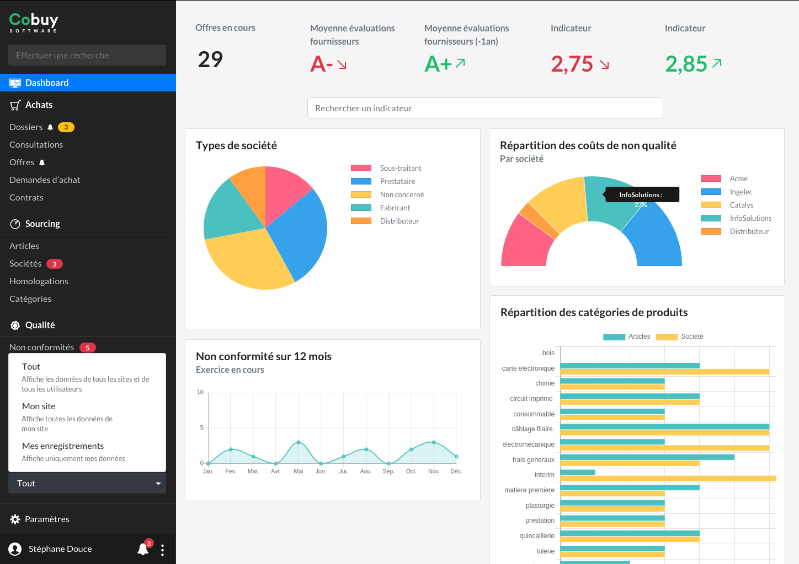

* table of contents
{:toc}

Cette page regroupe différentes recommandations pour l'interface de Cobuy. D'une part, des remarques générales qui s'appliqueront à tout l'interface utilisateur, et de l'autre, des remarques spécifiques à Cobuy

## Règles générales ##

Cette section regroupe des principes généraux qui s'appliquent à tout projet d'interface utilisateur.

#### Libellés ####

Les libellés tels que les titres, les en-têtes de tableaux et les libellés de champs sont des points d'informations très importants. Il convient de soigner leur présentation et leur sens.

Exemples

Au niveau de la présentation, **on tâchera d'utiliser exclusivement des bas-de-casse (minuscules) pour l'affichage des libellés et des textes de l'interface**. L'usage des capitales (majuscules) devrait être réservé à quelques cas exceptionnels, car leur lisibilité se réduit à mesure que la quantité de texte augmente à l'écran. 

> Dans une interface utilisateur, il n'y a en général aucune utilité à se servir de capitales, même pour surligner des informations importantes. On se servira plutôt des couleurs pour cet usage d'alerte.

temps du verbe : infinitif

respecter le sens de l'action. checkbox activé = possibilité supplémentaire pour l'utilisateur et non restriction.

article "modifier l'évaluation" plutôt que "modifier évaluation" : l'interface utiliateur essaie de parler un langage humain. surtout dans les actions et les alertes. La navigation peut se permettre d'être plus concise.

#### Champs de formulaires ####

taille des champs adaptée au contenu qu'il doit recevoir

#### Tableaux ####

alignement des chiffres

régles de réduction des titres 
- troncature
- Réduction pour gain d'espace
  - *Tx* pour taux
  - *Qté* pour quantité

#### Hiérarchie de l'information ####

Parfois, la quantité d'information présente à l'écran exige que l'on fasse un choix sur celle qui doit ressortir. Il n'est pas question ici de supprimer une information, mais d'échelonner la prise d'information de l'utilisateur.

Pour cela, nous avons plusieurs outils : **la graisse du caractère (gras, normal) et sa luminosité (noir ou gris clair).**

<hr/>
<span class="text-muted">Texte</span> `>` <span class="font-weight-bold text-muted">Texte</span> `>` <span>Texte</span> `>` <span class="font-weight-bold">Texte</span>
<p class="small text-muted">Styles disponibles pour hiérarchiser l'information.</p>
<hr/>


> La combinaison de ces éléments permet de nuancer un écran et de rendre digeste son appréhension par l'utilisateur.

info principale, contexte, méta-données

## Data ##



## Mécanismes de l'interface ##

Cette section regroupe des principes propres à l'interface utilisateur de Cobuy.

#### formulaires d'ajouts ####

Contenu

#### mécanismes de modifications ####

Contenu


## Historique des communications ##

Messages sortent et entrent à nouveau dans le système (communication avec des fournisseurs dans le cadre d'une consultation)

## Paramètres utilisateur ##
Certains affichages pourraient être contrôlés par l'utilisateur. Il faudra cependant veiller à ne pas intervenir de façon invisible pour l'utilisateur ; il faudra l'avertir du fait qu'un affichage peut être personnalisé, et éventuellement lui indiquer l'endroit où il peut le faire.

#### Dashboard ####

Permettre à l'utilisateur de choisir quels graphiques afficher sur le dashboard de l'application

#### Dimensions de l'interface ####

redimensionner l'interface. Proposer affichage par défaut ou petit

``` css
html, body{
    font-size : 16px;
}
```


``` css
html, body{
    font-size : 14px;
}
```

Bootstrap définit toutes se valeurs en `rem`, il faudra donc veiller à respecter cette règle pour que le redimensionnement de l'interface soit aisé.

## Dates ##
Durée relative plus parlante. Rappel de la date au format `jj/mm/aaaa` pas loin (ex. en-tête de dossier)
