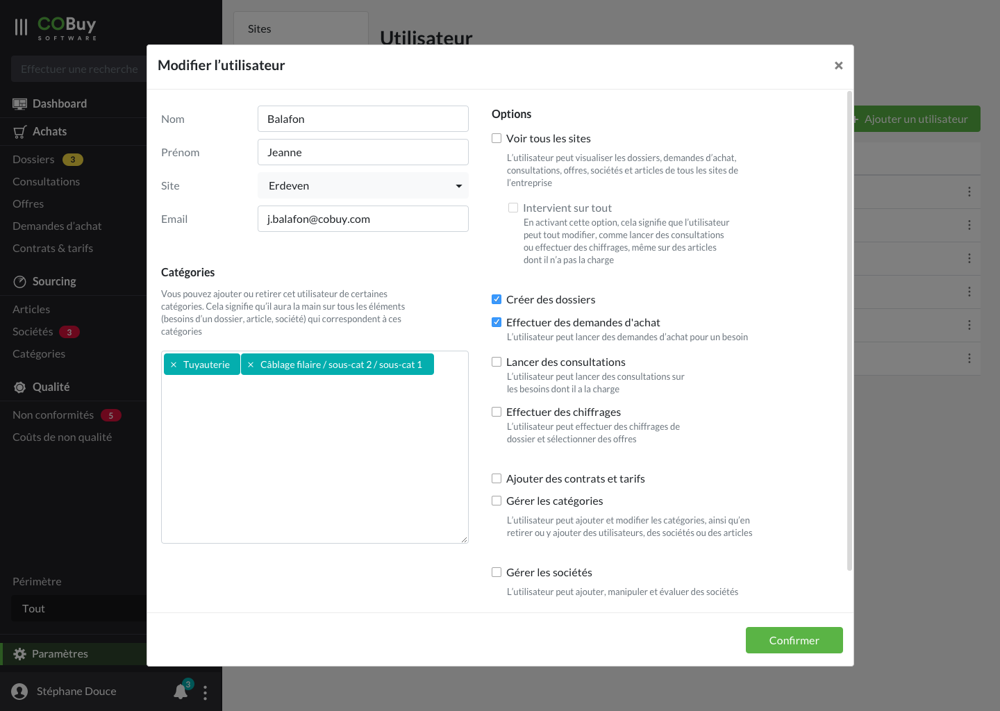

* table of contents
{:toc}

Ces paramètres ne peuvent être modifiés que par des utilisateurs ayant le statut d'administrateur. L'entrée `Paramètres` du menu de navigation ne peut être visible pour un utilisateur n''ayant pas le statut d'administrateur. La gestion de ce rôle spécial se fait en dehors de l'interface, aucun mécanisme n'étant pour l'instant prévu pour cela.

Ces paramètres seront gérés différemment en fonction de la taille ou de l'organisation de l'entreprise, et la gestion de ceux-ci est pensé pour prendre ces différences en compte. Voici un résumé des options de configuration possibles.

## Rôles & sites ##

#### Rôles ####

Les utilisateurs, en fonction de leur rôle, peuvent voir plus ou moins d'informations lors de leur connexion au système.

Les rôles sont établis selon plusieurs critères :
- une typologie de poste au sein de l'entreprise (acheteur, ingénieur R&D)
- un rang hiérarchique au sein de l'entreprise 

Les options configurables permettent de recouper ces critères, et d'ouvrir plus ou moins de droits aux utilisateurs.

#### Sites ####

Un utilisateur est lié à un site (champ `Site`). Cela contraint par défaut un utilisateur à la vision des données de ce site. Chaque utilisateur n'a qu'un site de référence ; pour voir plus de sites, on activera son option `Voir tous les sites`.

## Vision ##

Par défaut (options minimum), tout utilisateur voit ses enregistrements et les enregistrements de son site. Pour avoir accès à la vision sur plusieurs sites, son rôle doit être configuré dans ce sens.

À partir du moment où **il voit tout**, il peut avoir la possibilité **d'intervenir sur tout**, c'est à dire de "passer au dessus" de n'importe quel autre utilisateur. Ce rôle sera *a priori* dévolu à un profil de chef d'équipe. 

Cette *super-option* d'intervention totale revient à cocher toutes les options d'un utilisateur, et ceci pour toute autre utilisateur que soi-même.

Ci-dessous, l'exemple d'une configuration de base pour un utilisateur. Il n'a accès qu'à ses enregistrements, et à ceux de son site d'Erdeven, et peux créer des dosiers et effectuer des demandes d'achat.
  

  
En cochant l'option "Voir tous les sites", comme ci-dessous, la possibilité d'intervenir sur tout lui est alors ouverte. Certains sites peuvent également être exclues de son périmètre (ici, il peut tout voir sauf *Quimper*).

Dès qu'un nouveau site est ajouté au système, il pourra le voir, et il faudra venir exclure manuellement ce nouveau site pour lui retirer.  

## Édition ##

Les autres paramètres ouvrent le droit à effectuer plus ou moins d'actons : cela revient à donner la possibilité d'écrire plus ou moins de données dans le système.

## Périmètre visible dans l'interface ##

L'utilisateur peut modifier le périmètre des informations visibles grâce au composant de filtrage présent dans la barre de gauche.
Par défaut, le menu est configuré pour montrer les données du site de l'utilisateur. La possibilité de ne voir <u>que</u> ses informations lui est offerte en actionnant le menu.

  <a class="dropdown-item" href="#"><i class="ico ico-medium mr-2" style="color: #5AB445;">check</i>Mon site
Affiche toutes les données de mon site
</a>
  <a class="dropdown-item" href="#">Mes enregistrements
Affiche uniquement mes données
</a>

Dans le cas où l'option *tout voir* est cochée, une option est ajoutée à ce menu.

  <a class="dropdown-item" href="#">Tout
Affiche toutes les données de tous les sites  et de tous les utilisateurs
</a>
<a class="dropdown-item" href="#"><i class="ico ico-medium mr-2" style="color: #5AB445;">check</i>Mon site
Affiche toutes les données de mon site
</a>
  <a class="dropdown-item" href="#">Mes enregistrements
Affiche uniquement mes données
</a>

