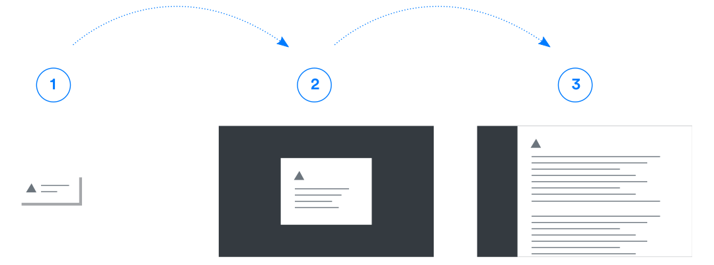

* table of contents
{:toc}

**Pour assurer une expérience utilisateur satisfaisante, il est important de garder à l'esprit que la cohérence est la clé.**

La conception fait système : si un utilisateur a appris qu'il doit aller chercher les actions de modifications à un endroit, il est important de toujours mettre à cet endroit les actions de modifications. **Le temps perdu à chercher une action n'est pas efficace, génère de la frustration et freine l'adoption du produit.** 

Avant d'envisager de créer un nouveau composant pour une fonctionnalité qui n'est pas décrite dans cette documentation, il conviendra d'envisager utiliser les éléments disponibles actuellement. Cela a deux effets bénéfiques : il n'est pas nécessaire de développer un composant _ad hoc_, et on bénéficie de l'apprentissage effectué par les utilisateurs sur le reste de l'application.

Tous les éléments de cette documentation, mis bout à bout, contribue à améliorer l'efficacité de l'utilisateur.

## Documentation de l'interface ##

Il est important de documenter au maximum l'utilisation du produit, afin que l'utilisateur sache seul effectuer les tâches. Cela passe par plusieurs moyens, qui seront employés par l'utilisateur de façon différente à mesure qu'il acquiert de l'expérience dans l'utilisation du produit :
- **Proposer un tour de l'interface** lors de sa première connexion (*on-boarding*). Des outils tels que [Intro.js](https://introjs.com/example/hello-world/index.html) sont dédiés à cette fonction
- **Donner un libellé explicite** et _human-readable_ aux actions de l'interface
- Offrir à l'utilisateur des **informations près des actions** qui pourraient lui poser question (cf. les explications présentes sous les libellés, [dans les formulaires](comp.modales.html))
- Si une anomalie est remontée suite à une action non conforme de l'utilisateur, celui-ci doit avoir **un retour lui proposant des indices** sur la façon d'avancer dans sa tâche
- **Fournir une documentation complète**, dans une section dédiée du site produit e.g. (Voir l'entrée aide du menu utilisateur). Cette documentation peut prendre plusieurs aspects : une base de connaissance (voir [Invision](https://support.invisionapp.com/hc/en-us/categories/360001714731-Knowledge-Base)), des tutoriaux sous [forme d'articles](https://glyphsapp.com/tutorials) ou sous forme de vidéos. En plus du site produit présentant ses avantages, cette documentation permet à un potentiel utilisateur d'entrer plus avant dans le produit. De multiples sociétés (voir Intercom, Wistia, Sketch, Evernote) ont des documentations disponibles publiquement qui permettent, de *l'extérieur*, d'avoir une bonne connaissance du produit et, de *l'intérieur*, de parfaire son utilisation et d'être plus efficace

En plus de donner à l'utilisateur des informations directes sur l'utilisation du produit, lui fournir de la connaissance engage une dynamique vertueuse : plus l'utilisateur acquiert de culture sur le produit, plus il l'adopte, et plus il s'en fait l'avocat autour de lui.

## Navigation ##

La structure de l'interface (voir notamment le gabarit [détails](gabarits.details.html) et la [navigation](comp.navigation.html)) est conçu pour faciliter cette navigation fluide.

La navigation comporte 3 grands aspects : 
- la navigation principale
- la navigation interne aux objets
- les mécanismes qui permettent de lier les contenus les uns aux autres.

### Navigation principale (sidebar) ###

La navigation principale est l'endroit à partir duquel part toute action dans l'interface. Ce composant permet de naviguer entre les objets, d'effectuer une recherche globale dans le système, de paramétrer l'application de façon globale (pour tous les utilisateurs) ou seulement pour soi, et d'être notifié des changements intervenus entre deux connexions.

Ce composant est tout le temps présent à l'écran. 2 états (déplié, replié). Comportement pour chacun.

> Plus de détails sur la section du composant [Navigation](comp.navigation.html)

#### Recherche globale ####

Voir [Recherche](comp.recherche.html)

### Navigation interne aux objets ###

Aussi appelée *sous-navigation*. Chaque objet est lié à plusieurs typologies de données (un dossier est lié à des demandes d'achat, des besoins). Ces données sont disponibles sous forme d'onglets.

{{ tabs }}

#### Navigation de troisième niveau ####

Il est parfois nécessaire d'avoir à subdiviser un contenu à ce niveau de profondeur. On utilisera alors pour cela des [*button groups* ](https://getbootstrap.com/docs/4.5/components/button-group/#basic-example).

{{ exemple }}

### Liaison des contenus ###

Outre les systèmes de navigation présentés ci-avant, plusieurs éléments sont à notre diposition pour faciliter le passage d'un objet à un autre, au sein de l'interface.

Si un objet possède un élément parent (une consultation liée à un dossier), on affiche un lien vers ce parent
(lien vers carte+parent)

Dans des reprises de liste d'objets au sein d'un autre objet
(lien vers exemple lien tableau)


#### Résumé et idée directrice ####

Le chemin vers une information est clair, cela passe par un arbre de navigation qui rend compte de la position de l'utilisateur dans l'interface. Les éléments sont toujours au même endroit.

> Par exemple, une consultation ne peut être consultée dans sa totalité que dans la section *Consultation*. Des informations relatives à celle-ci pourront être consultées dans un dossier, un article, etc. mais l'objet entier ne peut être vu que dans son contexte originel.

Cela implique de proposer autant de liens que possible entre les éléments du système, afin de limiter le nombre de clics pour atteindre une donnée

> Pour reprendre l'exemple de la consultation, on devrait toujours être à un clic de sa fiche complète, quel que soit l'endroit où des informations de celles-ci sont affichées.


## Créer & modifier ##

La création et la modification d'éléments du système se fait toujours à travers une fenêtre modale. Cela permet de dissocier visuellement les actions d'écriture par l'utilisateur des actions de lecture ― ou des actions opérées par le système. 

> L'utilisation de la fenêtre modale permet de poser un cadre cohérent à ces actions de saisie, et de mutualiser des composants (côté développement) et des façons de faire (côté utilisateur). 

L'accès à la modification se fait toujours via le même élément, un bouton affiché sous la forme d'une icone (`dots_v`).

> <i class="ico ico-large">dots_v</i>

Ainsi, une fois le mécanisme appris, cela vaut pour tous les éléments de l'interface. Quand l'utilisateur voit un bouton de ce type, il sait qu'il ira chercher là la possibilité de modifier une donnée.

Voir le composant [modales](comp.modales.html)

## Notifier, alerter ##

La notion de notification, ou d'alerte (selon la criticité de l'information) est présente à plusieurs niveaux de l'interface, et intervient selon des temporalités diverses. Il est également important de noter que l'utilisateur devrait être averti des actions négatives (erreur, non conformité d'une action) comme des actions positives (action ayant aboutie). Il conviendra pour cela de jauger finement la quantité d'informations à remonter à l'utilisateur : trop de messages, et il aurait tendance à ignorer et à manquer une notification importante dans un futur plus ou moins proche. Pas assez de messages, et l'utilisateur n'est pas capable de pondérer l'information ou de résoudre des problèmes dans l'interface.

> Le dévoilement progressif d'une information permet à un utilisateur d'avoir, selon son besoin, plus ou moins de détails (d'abord un message dans une notification, puis une vision plus détaillée dans une modale, puis une page retracant la totalité d'une anomalie *ou* une page de documentation pouvant aider l'utilisateur *e.g.*) 

<p class="small text-muted">Schéma de principe du dévoilement progressif d'une information</p>


#### À la connexion ####
On avertit l'utilisateur de changements qui auraient eu lieu depuis sa dernière connexion. Seul l'utilisateur voit ces notifications.

#### Notifications système ####
Certains objets de l'interface ont 

Il y a plusieurs moyens d'afficher ces informations : par des [cartes d'alertes](gabarits.details.html#alerte), ou [par des badges ](comp.navigation.html#notifications)à côté des entrées qui remontent des avertissements.

#### Après une action ####
Après une action directe de l'utilisateur, plusieurs types de notifications sont possibles : 
- l'action a abouti
- l'action n'a pas abouti
  - cela est lié à une action non conforme, ou non autorisée, de l'utilisateur
  - cela provient du système (erreur de configuration, éléments *down*, comme l'accès à une base de données *e.g.*)

Ces messages sont affichés sous forme de [toaster](comp.notifications.html). Conformément au principe évoqué en introduction de cette section, le message initial sera court, synthétique, et un bouton pourra diriger l'utilisateur vers une version plus détaillée de celui-ci, si nécessaire.

#### particulier ####

chiffrage, avertir l'utilisateur que l'information sous nos yeux n'est pas complète/erronnée

#### À propos de l'automatisation ####

Si le système effectue certaines tâches seules , l'utilisateur doit en être averti d'une façon ou d'une autre, et il doit savoir comment désengager cette automatisation. Il est perturbant pour l'utilisateur d'avoir sous les yeux une donnée dont il ignore la provenance, un paramètre modifié sans qu'il en ait la connaissance.

> L'automatisation est une bonne chose, mais l'utilisateur reste le maître à bord.

## Paramètres utilisateur ##
Certains affichages pourraient être contrôlés par l'utilisateur. Il faudra cependant veiller à ne pas intervenir de façon invisible pour l'utilisateur ; il faudra l'avertir du fait qu'un affichage peut être personnalisé, et éventuellement lui indiquer l'endroit où il peut le faire.

#### Dashboard ####

Permettre à l'utilisateur de choisir quels graphiques afficher sur le dashboard de l'application

#### Dimensions de l'interface ####

redimensionner l'interface. Proposer affichage par défaut ou petit

``` css
html, body{
    font-size : 16px;
}
```


``` css
html, body{
    font-size : 14px;
}
```

Bootstrap définit toutes se valeurs en `rem`, il faudra donc veiller à respecter cette règle pour que le redimensionnement de l'interface soit aisé.

## Historique des communications ##

Il est souhaitable, à terme, que les communications ou les données sortant du système puissent y entrer à nouveau facilement. Ainsi, les messages envoyés à des tiers (fournisseurs *e.g.*) doivent pouvoir recevoir des réponses qui pourront, ensuite, être consultées d'un bloc à l'endroit approprié. Les messages sont rangés et traçables, et cette continuité de l'information dans le système constitue un gage de clarté pour l'utilisateur.


